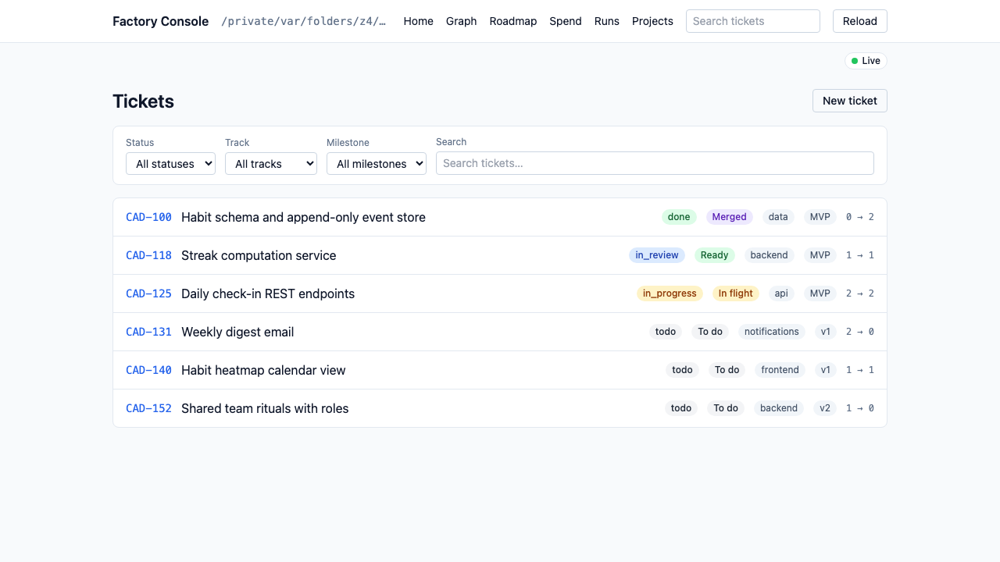
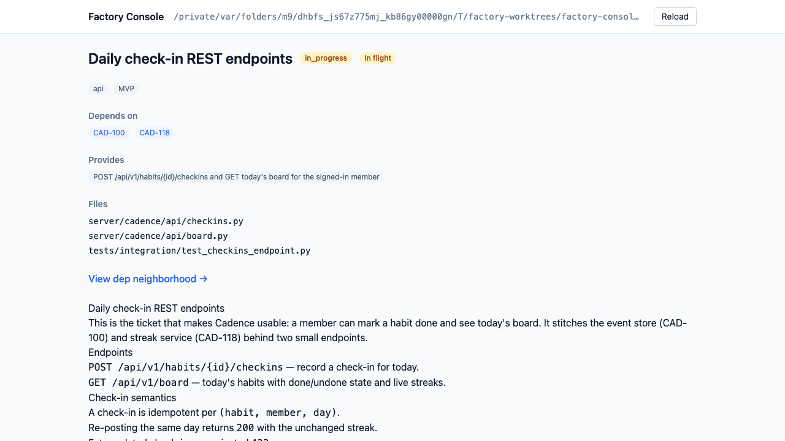
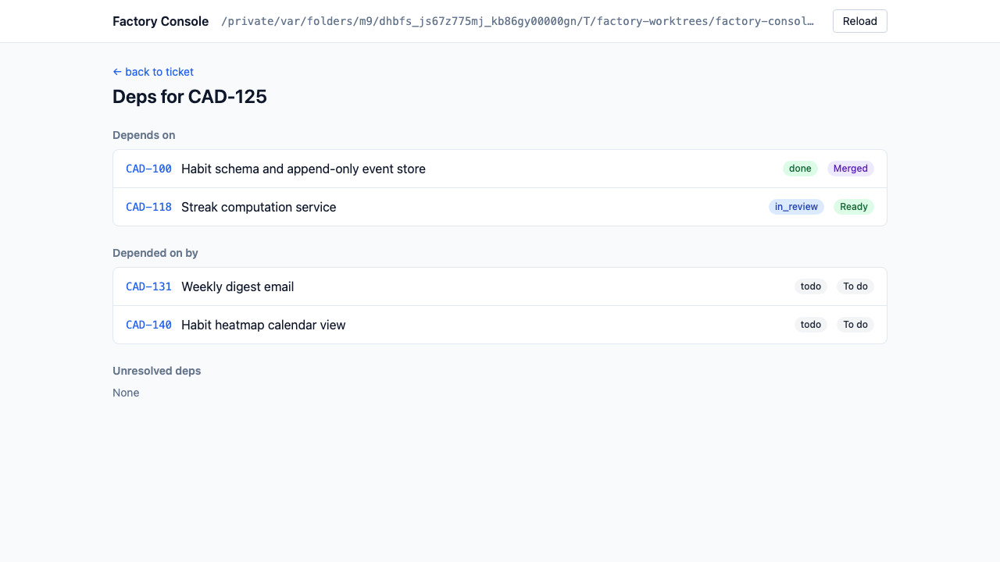
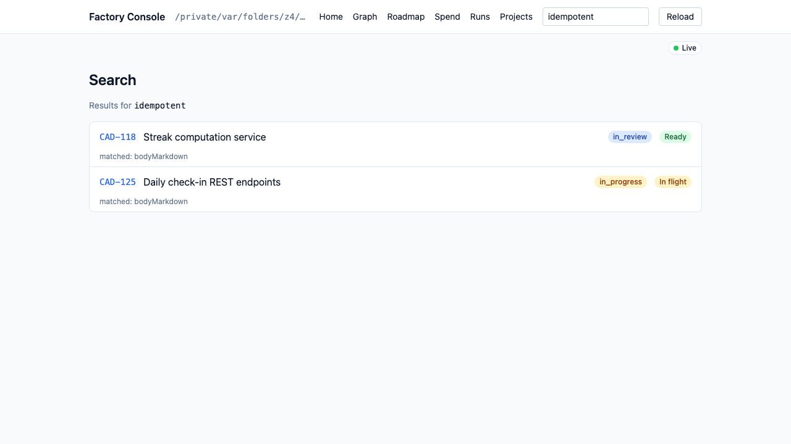
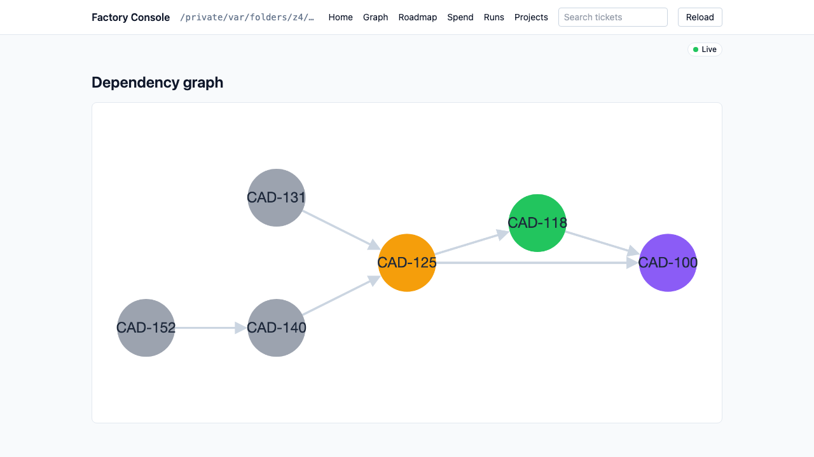
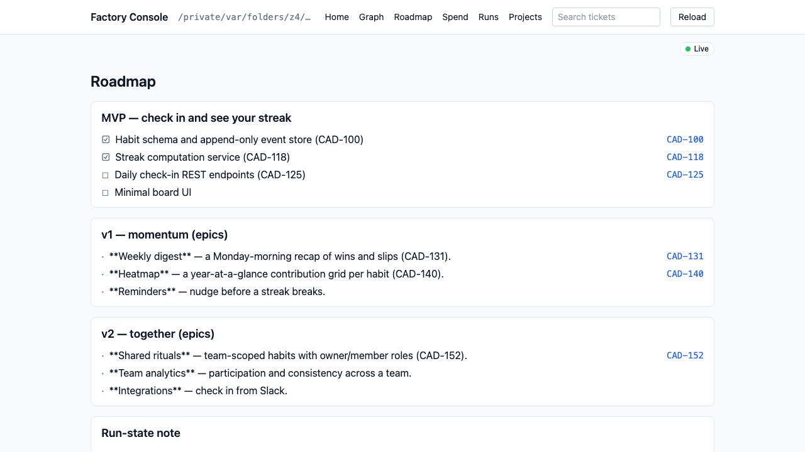

# Factory Console

[](https://github.com/abbasihsn/factory-console/actions/workflows/ci.yml)

A standalone local console that points at any App-Factory-generated project directory and lets you browse its tickets — status, title, description, and dependencies — and safely edit the ones a factory lane has not claimed yet.

## Install

Factory Console is a Python wheel on PyPI. Run it with no install via `uvx`, or install it with `pipx`:

```
uvx factory-console            # run without installing
pipx install factory-console   # install onto your PATH
```

## Verifying releases

Every tagged release (`vX.Y.Z`) is signed with a keyless [sigstore](https://www.sigstore.dev/) build-provenance attestation, produced by GitHub's OIDC-backed `actions/attest-build-provenance` action against the wheel and sdist published to PyPI — no long-lived signing key. Verify a downloaded artifact with the `gh` CLI:

```
gh attestation verify factory_console-X.Y.Z-py3-none-any.whl --repo abbasihsn/factory-console
```

The attestation bundle is also attached to the artifact's [GitHub Release](https://github.com/abbasihsn/factory-console/releases).

## Quickstart

From any App Factory project directory:

```
cd my-factory-project
factory-console
```

Within a few seconds the console discovers the project, starts a local server on `127.0.0.1`, and prints the URL to open in your browser (no cloud, no server infra). The UI shows:

- A searchable, filterable list of every ticket (id / status / title / track).
- A detail view with the rendered ticket `.md`, resolved `depends_on` / `provides`, and a factory run-state badge.
- **Edit and delete** from the detail view — an edit shows the exact diff for review before anything is written, and both are disabled (with the reason stated) once a factory lane owns a ticket. Delete is deliberately the wider of the two: a ticket the project's run-state does not list at all — one you added by hand, or just mistyped into the **New ticket** form — can be deleted but not edited, so the console can always undo what it created. The first write asks for the token the server printed at startup; it is kept for that browser tab only.
- A **New ticket** route (`/tickets/new`) with the same dry-run preview → review → apply flow as edits.
- A dependency-neighborhood view listing direct deps and dependents as clickable links.
- A **global full-text search** box (header) over a ticket's id, title, `provides`, and body, with results at `/search`.
- A **dependency graph** (`/graph`) — the whole project as a run-state-colored DAG; click a node to open its ticket.
- A **roadmap** (`/roadmap`) rendering the project's `ROADMAP.md` as milestone sections.
- **Run visibility** (`/runs`) — what the factory did per ticket: run state, PR link, outcome, and receipt, with every missing artifact named as missing rather than left blank — see [Runs](docs/usage.md#runs).
- **Spend visibility** (`/spend`) — what the factory cost, from its ledger: totals plus a breakdown by ticket, model, and agent level — see [Spend](docs/usage.md#spend).
- **Project registry management** (`/projects`) — register a project by path, and every project the console tracks, its probed condition, and per-row Select/Remove — see [Managing the registry](docs/usage.md#managing-the-registry).
- A **project condition banner** under the top bar, on every route, naming a degraded project's registered condition and its remedy — see [Managing the registry](docs/usage.md#managing-the-registry).
- **Live updates**: open pages auto-refresh over SSE when a ticket's run-state changes on disk, with a status indicator pill (and graceful fallback to the Reload button).

Press Ctrl-C to stop. See [`docs/usage.md`](docs/usage.md) for flags, exit codes, and path resolution.

## Screenshots

Captured from the real UI by the Playwright screenshots pipeline against the `with_run_state` fixture.



_The searchable ticket list at `/`._



_The `CAD-125` detail view with rendered body, deps, and run-state badge._



_The `CAD-125` dependency neighborhood listing its direct deps._



_Full-text search for `idempotent` at `/search`, matching two ticket bodies._



_The `/graph` dependency DAG, nodes colored by factory run-state._



_The `/roadmap` milestone view rendered from the project's `ROADMAP.md`._


_The live-update pill in its connected `Live` state._

Regenerate with `pnpm --dir frontend screenshots` (equivalently `pnpm --dir frontend e2e --grep screenshots && node frontend/scripts/copy-screenshots.mjs`).

## Docs

- [`docs/usage.md`](docs/usage.md) — install, run, flags, exit codes.
- [`docs/architecture.md`](docs/architecture.md) — the layered CLI → HTTP → Domain → FileAdapter design and its contracts.
- [`docs/contributing.md`](docs/contributing.md) — dev loop, tests, packaging, and release.
- [`docs/planning/`](docs/planning/) — the durable backbone: [`VISION.md`](docs/planning/VISION.md), [`ARCHITECTURE.md`](docs/planning/ARCHITECTURE.md), [`ROADMAP.md`](docs/planning/ROADMAP.md), and the [ticket manifest](docs/planning/tickets.json).

## Status

The MVP (read-only browsing — ticket list, detail, dependency neighborhood) and v1 (dependency graph, full-text search, roadmap view, live updates) have landed. v2 — safe editing of `todo` tickets behind a loopback write token, plus signed releases — is landing now. Work is built ticket-by-ticket from `docs/planning/tickets/` in dependency order — see [`docs/planning/ROADMAP.md`](docs/planning/ROADMAP.md) for the ladder.

## License

MIT. See [`LICENSE`](LICENSE).
