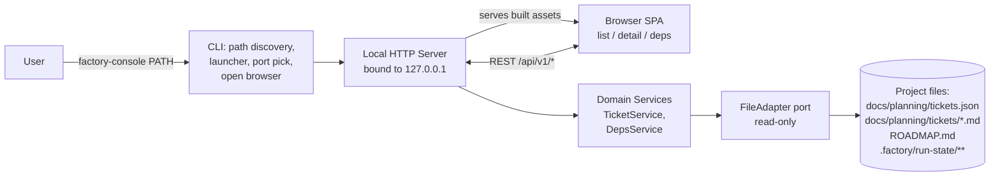

# Architecture — Factory Console

Durable backbone of the project. `/factory-plan-milestone` reads this to elaborate v1 / v2 tickets just-in-time once earlier milestones are built.

## One-line

Single-process local web application: `factory-console` CLI resolves a target project path, boots an embedded HTTP server bound to `127.0.0.1`, opens the default browser, serves a versioned REST API + the pre-built SPA as static assets from the same wheel. No database, no cache, no watcher; every request re-reads project files through a pure `FileAdapter` port.

## Diagram



## SDLC coverage

| Aspect | Status |
|---|---|
| product-vision | in-scope |
| data (DB) | N/A — files are the source of truth |
| backend | in-scope |
| ai/ml | N/A |
| api-contracts | in-scope |
| frontend | in-scope |
| cli / sdk | in-scope |
| auth / security | N/A for MVP — 127.0.0.1 trust boundary; loopback write token added in v2 |
| infra / devops | in-scope |
| observability | in-scope (minimal) |
| testing / quality | in-scope |
| configuration | in-scope |
| documentation | in-scope |

## Tech stack

### Server
- **Python 3.11+** (rationale: matches surrounding factory tooling; stdlib handles JSON/markdown; `uvx`/`pipx` give single-command install; cross-platform).
- **FastAPI** (Uvicorn ASGI) — Pydantic response models double as the shared-types contract; OpenAPI auto-published at `/api/v1/openapi.json`.
- **Typer** — CLI (`factory-console`).
- **pydantic-settings** — config (`FACTORY_CONSOLE_HOST/PORT/LOG_LEVEL`); host validator pinned to loopback.
- **markdown-it-py + mdit-py-plugins + bleach** — server-side rendering + sanitization.
- **PyYAML** — front-matter parsing.

### Frontend
- **SvelteKit** with `adapter-static` in SPA mode (`prerender=false`, `fallback=index.html`). Built to a plain folder that gets copied into the wheel.
- **TypeScript** (strict).
- **Tailwind CSS** (JIT).
- **openapi-typescript** — generates `src/lib/api/types.ts` from `/api/v1/openapi.json`.
- **Vitest** — unit; **Playwright** — e2e.

### Toolchain
- ruff + ruff-format (Python); eslint + prettier (front-end); pre-commit for both.
- GitHub Actions matrix `{ubuntu-latest, macos-latest} × {Python 3.11, 3.12}` — lint + pytest (85% coverage gate) + Vitest + wheel build + smoke install + Playwright e2e.
- Release: tag `vX.Y.Z` → PyPI via OIDC trusted publishing + GitHub Release.
- Multi-stage Dockerfile producing a lean, self-contained image (NOT the primary distribution). Base images use floating major-version tags, so it favors upstream security patches over bit-for-bit reproducibility.

### Rejected alternatives
- Go+chi (fastest cold start; rejected for stack coherence with surrounding factory tooling).
- Node+Fastify (would add a second runtime for users).
- HTML+HTMX (fine for MVP; painful once v1 adds a rendered DAG and v2 adds edit forms).
- PyInstaller single binary (macOS signing pain).

## Data model

No database. Source of truth is the target project's files, modeled as read-through domain entities that live in memory only during a single request.

- **Project** — `{ rootPath, ticketsManifestPath, ticketsDir, roadmapPath|None, runStateDir|None, discoveredAt }`. Constructed once per request.
- **Ticket** — `{ id, title, status, track|None, milestone|None, dependsOn: [str], provides: [str], files: [str], filePath, bodyMarkdown, bodyHtml, raw: dict }`. Joins a manifest entry with its `.md` at `docs/planning/tickets/<id>.md`.
- **TicketSummary** — list projection: `{ id, title, status, track, milestone, runState, depCount, dependentCount }`.
- **RunState** — enum `{ todo, in_flight, ready, merged, unknown }`, derived by probing the factory run-state directory.
- **DepNeighborhood** — `{ ticket, directDeps, directDependents, unresolvedDeps }`. Dependents computed by reverse-indexing `dependsOn` per request.
- **Roadmap** — `{ path, bodyMarkdown, bodyHtml }` — MVP detects presence; v1 renders full body.

**Schema tolerance (manifest)**: unknown fields preserved on `Ticket.raw`; missing optionals default sensibly; `schemaVersion` (if the factory writes one) surfaced but not enforced in v0. Forward-compat with future factory versions without coordinated release.

**Ticket-id constraint**: `^[A-Za-z0-9_.-]+$` — single source of truth at `factory_console.domain.ticket.TICKET_ID_PATTERN`. Enforced at Pydantic model boundary AND defense-in-depth in `file_adapter/ticket_md.py`.

## Contracts

### REST v1
Base: `http://127.0.0.1:<port>/api/v1`. JSON camelCase, ISO-8601, errors as `{ error: { code, message, details? } }` with proper HTTP status.

- `GET /api/v1/project` → `Project`.
- `GET /api/v1/tickets` → `{ items: TicketSummary[], total }` with optional `?status=&track=&milestone=&q=` filters (server-side).
- `GET /api/v1/tickets/{id}` → `Ticket` (includes rendered `bodyHtml` + resolved `runState`).
- `GET /api/v1/tickets/{id}/deps` → `DepNeighborhood`.
- `GET /api/v1/search?q=&limit=` → `{ items: SearchHit[], total }` — full-text over id/title/`provides`/body (distinct from the `tickets?q=` id+title filter); blank `q` → empty; `limit` 1–200, default 50.
- `GET /api/v1/roadmap` → `Roadmap | { present: false }` (presence-only in MVP).
- `GET /api/v1/health` → `{ ok, version, projectRoot }`.
- `GET /api/v1/openapi.json` — auto-generated schema; SPA regenerates TS types from it.

Versioning: URL-prefixed `/api/v1/`. Breaking changes → `/api/v2/` with a deprecation window.

### FileAdapter port
Python `Protocol`, read-only, eight methods (all but `load_project` take a `Project`):
- `load_project(root: Path) → Project`
- `list_tickets(project) → list[TicketSummary]`
- `get_ticket(project, ticket_id) → Ticket | None`
- `get_deps(project, ticket_id) → DepNeighborhood | None`
- `read_run_state(project, ticket_id) → RunState`
- `get_roadmap(project) → Roadmap | None`
- `search_tickets(project, query, *, limit=None) → list[SearchHit]` (best-first; blank query → `[]`)
- `get_graph(project) → TicketGraph` (whole-project run-state-coloured dependency DAG; resolved-only edges, self-loops and dangling ids omitted)

Two implementations: `RealFileAdapter` (hits real FS) and `FakeFileAdapter` (in-memory for tests). Handlers depend on the Protocol, wired via `FastAPI.Depends()`. This is the seam the file-adapter track owns; backend never touches `open()` directly.

### Factory run-state directory (read-only)
Fallback probe order: `<root>/.factory/run-state/`, then `<root>/docs/planning/.run-state/`. Per-ticket state via marker file or subdirectory:

- `<runStateDir>/todo/<id>`, `<runStateDir>/in-flight/<id>/`, `<runStateDir>/ready/<id>/`, `<runStateDir>/merged/<id>`.

Absence of the run-state dir → all tickets `RunState.unknown`. Present dir but missing marker → `RunState.todo`. The console **MUST NOT** write anything here in v0 or v2. v2's editing gate uses `RunState == todo` (or `unknown`) as the only editable predicate.

### CLI contract
```
factory-console [PATH] [--port N] [--host 127.0.0.1] [--no-browser] [--log-level LEVEL] [--version]
```
- Exit codes: `0` ok · `1` project-not-found · `2` port-in-use · `3` malformed manifest.
- Path resolution: `PATH` arg wins; else walk up from cwd looking for `docs/planning/tickets.json`.
- On success: `Factory Console vX.Y.Z — serving <root> at http://127.0.0.1:<port>` on stdout, then (unless `--no-browser`) opens the URL.

## Cross-cutting

- **Config**: pydantic-settings. Env prefix `FACTORY_CONSOLE_`. `host` field-validator refuses anything not in `{127.0.0.1, localhost, ::1}`.
- **Logging**: stdlib logging, one line per request `LEVEL ts method path status dur_ms`; `--log-level` flag; stderr only.
- **Errors**: single `errors.py` defines `FactoryConsoleError` base + `to_error_response(exc)`. Concrete subclasses live in the modules that raise them (`file_adapter/*`, `services/*`). Backend registers ONE FastAPI exception handler catching `FactoryConsoleError` + a `RequestValidationError` handler that special-cases `TICKET_ID_PATTERN` violations to emit `{ status: 400, code: 'invalid_ticket_id' }` (uniform with `PathTraversal` from ticket_md).
- **Auth**: N/A in v0 — 127.0.0.1 binding is the trust boundary. No cookies, no CORS (same-origin), no CSRF (no state changes). v2 writes add a per-session loopback token.
- **Input validation**: Pydantic at every boundary; ticket-id regex enforced defense-in-depth in `_safe_resolve`.
- **Concurrency**: single-worker Uvicorn. No locks (no writes in MVP).

## DevOps

- **Single-command launch**: `uvx factory-console` or `pipx install factory-console && factory-console`. Wheel embeds the pre-built SPA under `factory_console/_static/` — no Node dependency at runtime.
- **Dev loop**: `scripts/dev.sh` runs Uvicorn `--reload` alongside Vite dev; Vite proxies `/api/*` to the Python port. `factory_console.app:create_dev_app` is the zero-arg factory Uvicorn boots.
- **Packaging**: `scripts/package.sh` builds SPA → copies to `_static/` → `python -m build`.
- **Dockerfile**: multi-stage (node builder → python builder → thin runtime) producing a lean, self-contained image. Not the primary distribution; uses floating major-version base tags (patches over bit-for-bit reproducibility).
- **CI**: matrix over `{ubuntu-latest, macos-latest} × {Python 3.11, 3.12}` — lint, pytest, Vitest, wheel build, smoke install, Playwright e2e. Concurrency group cancels stale runs.
- **Release**: tag `vX.Y.Z` → PyPI via OIDC trusted publishing + GitHub Release (wheel + sdist attached).
- **Environments**: dev (source checkout, hot reload) + prod (installed wheel). No staging, no cloud.

## Testing strategy

- **Unit (Python)** — pure functions in `file_adapter/` (manifest, ticket .md, discovery, run-state) against `tmp_path` fixtures; `services/` against `FakeFileAdapter`. Target >90% on `file_adapter/` + `services/`. Overall gate 85%.
- **Integration (Python)** — `httpx.AsyncClient` against the FastAPI app with `FakeFileAdapter` for happy paths and `RealFileAdapter` against `tests/fixtures/projects/*` for realism.
- **CLI integration** — subprocess-launch `factory-console` on a fixture, parse printed port, hit `/health`, SIGINT, assert clean exit.
- **Frontend unit (Vitest)** — components render given fixture props; store logic covered.
- **E2E (Playwright)** — boots the packaged CLI on `tests/fixtures/projects/with_run_state/`, drives a real browser through list → filter → click ticket → see body + deps + run-state → click a dep. This IS the MVP acceptance harness.
- **Fixtures as contract** — `tests/fixtures/projects/` doubles as executable docs of supported project shapes.
