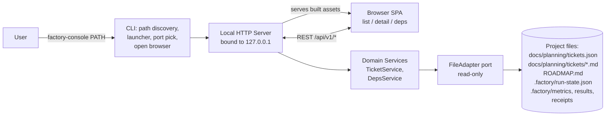

# Architecture — Factory Console

Durable backbone of the project. `/factory-plan-milestone` reads this to elaborate v1 / v2 tickets just-in-time once earlier milestones are built.

## One-line

Single-process local web application: `factory-console` CLI resolves a target project path, boots an embedded HTTP server bound to `127.0.0.1`, opens the default browser, serves a versioned REST API + the pre-built SPA as static assets from the same wheel. No database, no cache, no watcher; every request re-reads project files through a pure `FileAdapter` port.

## Diagram



## SDLC coverage

| Aspect | Status |
|---|---|
| product-vision | in-scope |
| data (DB) | N/A — files are the source of truth |
| backend | in-scope |
| ai/ml | N/A |
| api-contracts | in-scope |
| frontend | in-scope |
| cli / sdk | in-scope |
| auth / security | N/A for MVP — 127.0.0.1 trust boundary; loopback write token added in v2 |
| infra / devops | in-scope |
| observability | in-scope (minimal) |
| testing / quality | in-scope |
| configuration | in-scope |
| documentation | in-scope |

## Tech stack

### Server
- **Python 3.11+** (rationale: matches surrounding factory tooling; stdlib handles JSON/markdown; `uvx`/`pipx` give single-command install; cross-platform).
- **FastAPI** (Uvicorn ASGI) — Pydantic response models double as the shared-types contract; OpenAPI auto-published at `/api/v1/openapi.json`.
- **Typer** — CLI (`factory-console`).
- **pydantic-settings** — config (`FACTORY_CONSOLE_HOST/PORT/LOG_LEVEL`); host validator pinned to loopback.
- **markdown-it-py + mdit-py-plugins + bleach** — server-side rendering + sanitization.
- **PyYAML** — front-matter parsing.

### Frontend
- **SvelteKit** with `adapter-static` in SPA mode (`prerender=false`, `fallback=index.html`). Built to a plain folder that gets copied into the wheel.
- **TypeScript** (strict).
- **Tailwind CSS** (JIT).
- **openapi-typescript** — generates `src/lib/api/types.ts` from `/api/v1/openapi.json`.
- **Vitest** — unit; **Playwright** — e2e.

### Toolchain
- ruff + ruff-format (Python); eslint + prettier (front-end); pre-commit for both.
- GitHub Actions matrix `{ubuntu-latest, macos-latest} × {Python 3.11, 3.12}` — lint + pytest (85% coverage gate) + Vitest + wheel build + smoke install + Playwright e2e.
- Release: tag `vX.Y.Z` → PyPI via OIDC trusted publishing + GitHub Release.
- Multi-stage Dockerfile producing a lean, self-contained image (NOT the primary distribution). Base images use floating major-version tags, so it favors upstream security patches over bit-for-bit reproducibility.

### Rejected alternatives
- Go+chi (fastest cold start; rejected for stack coherence with surrounding factory tooling).
- Node+Fastify (would add a second runtime for users).
- HTML+HTMX (fine for MVP; painful once v1 adds a rendered DAG and v2 adds edit forms).
- PyInstaller single binary (macOS signing pain).

## Data model

No database. Source of truth is the target project's files, modeled as read-through domain entities that live in memory only during a single request.

- **Project** — `{ rootPath, ticketsManifestPath, ticketsDir, roadmapPath|None, runStateSource|None, runStateDir|None, discoveredAt }`. Constructed once per request. `runStateSource` is the resolved run-state artifact (`{ kind: "json" | "directory", path }`) and is what every run-state read dispatches on; `runStateDir` answers only "which directory, if any, is the source", and is `None` for a JSON-sourced project — see "Factory run-state source" below.
- **Ticket** — `{ id, title, status, track|None, milestone|None, dependsOn: [str], provides: [str], files: [str], filePath, bodyMarkdown, bodyHtml, raw: dict }`. Joins a manifest entry with its `.md` at `docs/planning/tickets/<id>.md`.
- **TicketSummary** — list projection: `{ id, title, status, track, milestone, runState, depCount, dependentCount }`.
- **RunState** — enum, derived from the project's resolved run-state **source** (`.factory/run-state.json` in preference to a legacy marker directory — see "Factory run-state source" below, which is normative for HOW each member is resolved). Members: the factory's nine states `{ todo, in_progress, ready, in_part, in_submilestone, merged, flagged, failed, needs_human }`; the one further name only the legacy marker directory can express, `in-flight` (the console's own name — the factory has no such state); and the three console-side "no state was read" answers `{ unknown, absent, unreadable }`, which are not factory states at all and are the ones the write gates discriminate on. Single source of truth: `factory_console.domain.run_state.RunState`; the SPA's union is generated from it, never hand-maintained.
- **DepNeighborhood** — `{ ticket, directDeps, directDependents, unresolvedDeps }`. Dependents computed by reverse-indexing `dependsOn` per request.
- **Roadmap** — `{ path, bodyMarkdown, bodyHtml }` — MVP detects presence; v1 renders full body.

**Schema tolerance (manifest)**: unknown fields preserved on `Ticket.raw`; missing optionals default sensibly; `schemaVersion` (if the factory writes one) surfaced but not enforced in v0. Forward-compat with future factory versions without coordinated release.

**Ticket-id constraint**: `^[A-Za-z0-9_.-]+$` — single source of truth at `factory_console.domain.ticket.TICKET_ID_PATTERN`. Enforced at Pydantic model boundary AND defense-in-depth in `file_adapter/ticket_md.py`.

## Contracts

### REST v1
Base: `http://127.0.0.1:<port>/api/v1`. JSON camelCase, ISO-8601, errors as `{ error: { code, message, details? } }` with proper HTTP status.

- `GET /api/v1/project` → `Project`.
- `GET /api/v1/tickets` → `{ items: TicketSummary[], total }` with optional `?status=&track=&milestone=&q=` filters (server-side).
- `GET /api/v1/tickets/{id}` → `Ticket` (includes rendered `bodyHtml` + resolved `runState`).
- `GET /api/v1/tickets/{id}/deps` → `DepNeighborhood`.
- `GET /api/v1/search?q=&limit=` → `{ items: SearchHit[], total }` — full-text over id/title/`provides`/body (distinct from the `tickets?q=` id+title filter); blank `q` → empty; `limit` 1–200, default 50.
- `GET /api/v1/roadmap` → `Roadmap | { present: false }` — the full rendered body (`bodyMarkdown` + `bodyHtml`) plus structured `milestones[]`, or the `{ present: false }` envelope when the project has no roadmap.
- `GET /api/v1/graph` → `TicketGraph` (`{ nodes, edges }`) — the whole-project run-state-coloured dependency DAG; one node per ticket, one edge per resolved `dependsOn` (self-loops and dangling ids omitted).
- `GET /api/v1/spend` → `SpendResponse` (`{ source, attribution, totals, byTicket, byModel, byLevel, skipped, skippedOmitted }`) — the factory's ledger aggregated by ticket, model and agent level; `attribution` names the cost-splitting rule (`full-to-each-id`, so per-ticket figures are *attributed* cost and may exceed `totals.costUsd`), and `source.found`/`source.read` tell no ledger from an unread one from a measured zero.
- `GET /api/v1/runs` → `{ items: ProjectedRunRecord[], total }` — one record per MANIFEST ticket, in manifest order; each carries a `result` and a `receipt` as `{ path, data, reason }`, where `reason` NAMES why a source is missing (`absent` | `unreadable` | `unparseable` | `too_large`). `data` is **not** the artifact verbatim: it is a `{ [key: string]: string }` holding only the keys named in `DISCLOSED_ARTIFACT_FIELDS` (`api/v1/runs.py`) that the artifact actually carries as strings — today `pr_url` and `status`, `{}` when it names neither — per the disclosure rule under "Other factory artefacts" below. A project the factory has never run is `200` with every source `absent` — never a 404 and never `[]`, since `.factory/` is gitignored and having no artifacts is the normal state of a fresh clone.
- `GET /api/v1/health` → `{ ok, version, projectRoot }`.
- `GET /api/v1/openapi.json` — auto-generated schema; SPA regenerates TS types from it.

Versioning: URL-prefixed `/api/v1/`. Breaking changes → `/api/v2/` with a deprecation window.

### FileAdapter port
Python `Protocol`, read-only, eight methods (all but `load_project` take a `Project`):
- `load_project(root: Path) → Project`
- `list_tickets(project) → list[TicketSummary]`
- `get_ticket(project, ticket_id) → Ticket | None`
- `get_deps(project, ticket_id) → DepNeighborhood | None`
- `read_run_state(project, ticket_id) → RunState`
- `get_roadmap(project) → Roadmap | None`
- `search_tickets(project, query, *, limit=None) → list[SearchHit]` (best-first; blank query → `[]`)
- `get_graph(project) → TicketGraph` (whole-project run-state-coloured dependency DAG; resolved-only edges, self-loops and dangling ids omitted)

Two implementations: `RealFileAdapter` (hits real FS) and `FakeFileAdapter` (in-memory for tests). Handlers depend on the Protocol, wired via `FastAPI.Depends()`. This is the seam the file-adapter track owns; backend never touches `open()` directly.

### Factory run-state source (read-only)

> **Correction (v2.1 / T86) — this section used to be wrong about the factory.** It was titled
> "Factory run-state directory (read-only)" and described a directory the factory does not write.
> It gave a probe order of `<root>/.factory/run-state/` then `<root>/docs/planning/.run-state/`, a
> four-name vocabulary (`todo` / `in-flight` / `ready` / `merged`), and two resolution rules:
> *"Absence of the run-state dir → all tickets `RunState.unknown`. Present dir but missing marker →
> `RunState.todo`."* Measured against the factory: it writes `.factory/run-state.json`, and its
> vocabulary is the nine values of `FAC_STATES` — **none of which is `in_flight`**. That name was
> the console's own invention and survives only as a legacy marker-directory spelling
> (`in-flight`), never as something the factory says. The string `run-state.json` did not appear in
> this file at all.
>
> The console's code **faithfully implemented the text above**, which is why no test caught the
> gap: the contract was wrong about the factory, not the code wrong about the contract. So the
> rules below are a **behaviour change** as well as a correction — most of all the quoted
> *"present dir but missing marker → `RunState.todo`"*, which is now `absent` and refuses an edit
> where `todo` allowed one.
>
> **History.** The correction was worked out ticket by ticket in `docs/planning/tickets/v2.1/`:
> `T78` (read the source the factory actually writes; model the nine states it actually has),
> `T80` + its amendments 1–4 (the four-way split, the resolution invariant, `unknown` narrowed to
> silence), `T92` + its amendments 1–2 (the invariant reaching the directory form, and
> MONOTONICITY — the property every one of these rules turned out to be an instance of). Those
> ticket files remain the narrative record of *how* the defect happened; this section is the
> settled contract, and it is what a lane builds against.

#### The source

The console resolves **one run-state source** per project and reports which one it used —
`Project.runStateSource` = `{ kind: "json" | "directory", path }`. Probe order:

1. `<root>/.factory/run-state.json` — what the factory writes (T78);
2. `<root>/.factory/run-state/` — legacy marker directory;
3. `<root>/docs/planning/.run-state/` — legacy marker directory, older location.

The resolved thing is called a **source** everywhere, not "the run-state directory": the directory
is one of two forms it can take, and the one the factory no longer produces.
`Project.runStateDir` is kept only to answer "which directory, if any, is the source" — a
JSON-sourced project has `runStateDir is None` — and every run-state read dispatches on
`runStateSource`.

In the directory form, per-ticket state is a marker file or subdirectory named by the state:
`<runStateDir>/todo/<id>`, `<runStateDir>/in-flight/<id>/`, `<runStateDir>/ready/<id>/`,
`<runStateDir>/merged/<id>`.

The console **MUST NOT write to any run-state source**, in any version. The first two locations
live under `.factory/`, which is machine-local and gitignored (see "Other factory artefacts"
below), so **no source is guaranteed to exist** — a fresh clone of a heavily-run project may resolve
none at all, and the third location, being under `docs/planning/`, is the only one a clone carries.

#### Vocabulary

The factory's own states — the nine values of `FAC_STATES`, as written to `run-state.json`:

`todo` · `in_progress` · `ready` · `in_part` · `in_submilestone` · `merged` · `flagged` ·
`failed` · `needs_human`

The legacy marker directory can only express four names — `todo`, `in-flight`, `ready`, `merged` —
and `in-flight` is **the console's own name for a directory form the factory has stopped writing**,
not a factory state. Nothing in the factory is ever called `in_flight`.

On top of those, the console has three answers of its own. **They are not factory states**: no
source ever names them, and no lane ever puts a ticket into one. They record what the console
learned when it went looking, and they are what the write gates discriminate on:

- **`unknown`** — nothing was said.
- **`absent`** — a populated source answered, and its answer is "not listed".
- **`unreadable`** — something was said and the console could not make it out.

#### Resolution — four-way, not two

- **No source at all → `unknown`** (mutable). A project with no usable run-state must stay fully
  usable in the console.
- **A resolved but VACUOUS source → `unknown`** (mutable). A marker directory holding no marker
  for any ticket, or a `run-state.json` whose `tickets` object parsed and is empty. A source that
  names nobody exercises no authority over anybody; answering `absent` here would turn an
  empty-but-valid run-state into a project-wide read-only lockout. Also `unknown`: a source whose
  whole document was read and could not be parsed or understood, because a document that resolved
  into nothing named no ticket either.
- **A POPULATED source that does not list this ticket → `absent`** — refused an **edit**, but
  still **deletable**. This replaces *"present dir but missing marker → `RunState.todo`"* and is a
  deliberate behaviour change. It stays deletable because `create_ticket` is ungated: a ticket the
  console just minted is `absent` in any project with a populated source, and refusing the delete
  too would leave a mistyped new ticket unrecoverable through the UI that created it.
- **A source that IS there and could not be READ → `unreadable`** — refused for **both** edit and
  delete. `EACCES` on a marker directory or one of its state subdirectories, an I/O error on
  `run-state.json`, a directory entry that will not `stat`, and equally the *read-but-unintelligible*
  cases: an entry naming this ticket under a `status` outside the alias table, under a non-string
  `status`, under an entry that is not an object, or a marker under a state subdirectory outside the
  four the console can name. The 409 names the source path, so an operator reads it as a problem
  with the source rather than as "this ticket is not tracked".

A **vanished** source — one that is no longer there when probed — resolves **`unknown`**: nothing
is there to hide a marker, so it behaves exactly like a project with no source. An **unreadable**
one resolves **`unreadable`**. **The two must not be folded together.** The first three cases above
are "I looked and there is nothing to find"; the fourth is "I could not look", and granting a write
because the check could not run is the fail-open this split exists to close.

#### The resolution invariant

> **MONOTONICITY. Resolution must be monotone in information: if input A reveals strictly less than
> input B, A's answer must be no more permissive than B's. There is no filesystem state so degraded
> that it grants access a better-understood state would refuse.**

Every rule in this section is a corollary. A resolution that could not establish what it needed —
whether because it could not be read, or because it was read and could not be interpreted — must
**refuse**; it may never fall back to a state *more permissive* than the one it failed to check.
"I looked and found nothing" and "I could not look" are different answers, and only the first may
return a mutable state. What could not be read is **recorded, never dropped**: discarding an entry
that failed to `stat` leaves a collection that looks smaller and cleaner, which reads downstream as
*more* information, not less.

Concretely, for the legacy directory form:

- The marker-precedence walk is `merged` > `ready` > `in-flight` > `todo`, and it returns a marker
  only when every state **at or above** it was readable — so a stale `todo/<id>` under an
  unreadable `merged/` resolves `unreadable`, not the mutable `todo`. A state directory *below* an
  answer already read does not change it.
- A **state subdirectory outside those four names** (`.factory/run-state/in_review/`, once the
  factory grows a tenth `FAC_STATES` entry) is the factory speaking in a vocabulary this console
  does not know. An id **named** under such a subdirectory resolves `unreadable` — **per id**, since
  a misplaced folder must not turn a whole project read-only — and it refuses **ahead of any
  recognised marker for the same id**, because a state with no name has no rank either.
- An unrecognised subdirectory that **opens and names nobody** changes nothing. One that **will not
  open**, or an entry that will not `stat` (a symlink loop raising `ELOOP`), is not empty — it is
  unknown — and refuses **per source**, for every id in it, ahead of any recognised marker.
- A run-state directory that cannot be **enumerated** refuses every id in the source, ahead of the
  marker walk.
- **Vacuity counts markers under EVERY subdirectory**, not only the four named ones. A source whose
  markers all live under `in_review/` *lists* tickets — the console simply cannot name their states
  — so ids it does not name stay `absent` rather than becoming the mutable `unknown`.
- The same rule binds source **discovery**: a location that could not be probed becomes the source
  and refuses, rather than being skipped into "this project has no run-state".

#### The two write predicates

There are **two** allowlists, not one editable predicate:

- `MUTABLE_STATES` = `{ todo, unknown }` — gates **edit** (`ensure_mutable`).
- `DELETABLE_STATES` = `MUTABLE_STATES` + `{ absent }` — gates **delete** (`ensure_deletable`).

`unreadable` is in neither. `create_ticket` passes no gate at all, which is why delete is the wider
of the two.

Refusals are `409 ticket_not_mutable`, and their wording is part of the contract, because the
authorization answer is shared while the **remedy** differs:

- unrecognised `status`/state value → names the value the console could not interpret ("upgrade the
  console"), never "could not be read";
- a source that could not be read → names the source path and the failure mode ("fix the
  permissions"), and must not offer delete as a way out;
- an unsearchable state subdirectory → names the directory it **could not look in** — carried in
  the operator-facing log, since nothing was read and there is no value to quote;
- a run-state directory that could not be enumerated → names the directory itself and says it
  **could not be enumerated**, with no subdirectory named (the listing that would have produced a
  name is what failed);
- an entry that would not `stat` → says it **could not be identified**;
- `absent` → says the console will not **edit** the ticket and that it can still be deleted.

### Other factory artefacts (read-only)

Beside the run-state source, the console reads four more factory-owned artefacts. It writes to none
of them. Three of the four — the per-ticket lane results and receipts, and last stop — are read
without modelling a single field inside them: the READING layer (the file adapter and the domain
types) carries such a payload as an untyped JSON object, `ArtifactRead.data` is `dict[str, Any]`, and
`RunRecord` composes those verbatim. The spend ledger is the exception and the only one: it is a
typed reading path end to end — `LedgerEntry` (`domain/ledger.py`) names and types every field it
consumes, and `SpendReport`/`SpendResponse` (`domain/spend.py`) publish that on the wire.

**The disclosure rule (v2.2 / T102).** Reading loosely is not licence to publish loosely, and the two
must not be confused:

> A read-only endpoint MUST NOT serialise an unmodelled, factory-written artefact verbatim. It may
> disclose only the specific fields a real consumer needs — declared by name, in one place, at the
> point of disclosure, and covered by a test — never the whole untyped payload.

The reason is that "unmodelled" means the console cannot enumerate what is in the file, so forwarding
it whole discloses whatever another program chose to put there (the factory's own metrics carry
session ids, model names, token counts and cost) for a view that reads two keys. Both endpoints that
touch an artefact obey it. `/spend` already did: `domain/spend.py`'s `SkippedLineInfo` declines to
project the ledger's raw `excerpt`, and `ledger.py` redacts `session_id` before it can leave the
module. `/runs` now does too — the DISCLOSURE boundary is the API response model, which is a
narrowing of the domain type and not the domain type itself: `api/v1/runs.py` declares
`DISCLOSED_ARTIFACT_FIELDS` and rebuilds each `ArtifactRead` as a `ProjectedArtifactRead`
(`data: dict[str, str] | None`) carrying only those keys, so the reading layer stays untyped end to
end while the wire carries a declared, tested allowlist. `tests/integration/test_disclosure_policy.py`
enforces the rule generically over the app's response schemas, so a third endpoint inherits it
without anyone rereading this paragraph.

Two names are declared, in the two places that act on them, and they are the same two. The Runs view
reads `pr_url` and `status` out of a lane result to render its PR and Outcome columns, and the server
discloses exactly those. Both lists are **unverified** — no captured artefact from a real factory run
exists in this repo to check them against — so neither is a schema: the frontend's is enumerated once
in `PROJECTED_FIELDS` (`frontend/src/routes/runs/+page.svelte`), narrowed into the field readers so an
undeclared key is a compile error, guarded by `frontend/src/routes/runs/projected-fields.test.ts`, and
rendered so a miss reads as "no PR url / no status under any key this console recognises" rather than
as a claim about the artefact; the server's is `DISCLOSED_ARTIFACT_FIELDS` above. They are two
declarations because they answer different questions — what may LEAVE the process, and what the view
may READ — and growing either is a deliberate, reviewable edit in one place. Growing only the
frontend's yields a field the view can name and the server will not send, which is the intended
failure mode. Nothing else in the stack may read or disclose a named field out of an untyped artefact
payload (the ledger's typed model above is not one).

| Artefact | Path | Read by |
|---|---|---|
| Spend ledger | `<root>/.factory/metrics/ledger.jsonl` | `GET /api/v1/spend` |
| Lane results | `<root>/.factory/results/<ticketId>.json` | `GET /api/v1/runs` |
| Lane receipts | `<root>/.factory/receipts/<ticketId>.json` | `GET /api/v1/runs` |
| Last stop | `<root>/.factory/last-stop.json` | *not yet surfaced by any endpoint* |

The file-adapter reader for last stop exists (`read_last_stop`), but nothing composes it into a
response yet: it carries no ticket id — it is one artefact per PROJECT saying why the last run
stopped — so it does not belong on the per-ticket `RunRecord`, and `GET /api/v1/runs` therefore
carries only `result` and `receipt` (see "REST v1" above, which is authoritative for what is on the
wire). Whichever ticket surfaces last stop owns where it belongs.

**The rule that governs all of them: `.factory/` is gitignored, so every source is OPTIONAL, and a
missing one renders as MISSING — never as zero and never as empty.** Having no artefacts is the
normal state of a fresh clone, not a measurement. So every read returns *why* it is empty rather
than a bare `None`: `absent` | `unreadable` | `unparseable` | `too_large` for the per-ticket
artefacts (`ArtifactRead = { path, data, reason }`), and `source.found` / `source.read` for the
ledger — which is what lets `GET /api/v1/spend` tell no ledger from an unread one from a measured
zero, and `GET /api/v1/runs` answer `200` with every source `absent` rather than `404` or `[]`. See
those two entries under "REST v1" above for the response shapes.

Two consequences worth stating, since both look like bugs until explained:

- **Attributed cost.** A ledger entry naming several tickets is charged **in full to each** id it
  names (`attribution: full-to-each-id`), so `byTicket` can sum to **more** than `totals.costUsd`.
  Deliberate: splitting a lane's cost across the ids it touched would invent a division the factory
  never recorded.
- **Run-state and run artefacts are different sources.** A project can show a full board of
  `merged` / `flagged` badges and have no results or receipts at all — the legacy marker directory
  under `docs/planning/` is committed, while `.factory/` is not.

### CLI contract
```
factory-console [PATH] [--port N] [--host 127.0.0.1] [--no-browser] [--log-level LEVEL] [--version]
```
- Exit codes: `0` ok · `1` project-not-found · `2` port-in-use · `3` malformed manifest.
- Path resolution: `PATH` arg wins; else walk up from cwd looking for `docs/planning/tickets.json`.
- On success: `Factory Console vX.Y.Z — serving <root> at http://127.0.0.1:<port>` on stdout, then (unless `--no-browser`) opens the URL.

## Cross-cutting

- **Config**: pydantic-settings. Env prefix `FACTORY_CONSOLE_`. `host` field-validator refuses anything not in `{127.0.0.1, localhost, ::1}`.
- **Logging**: stdlib logging, one line per request `LEVEL ts method path status dur_ms`; `--log-level` flag; stderr only.
- **Errors**: single `errors.py` defines `FactoryConsoleError` base + `to_error_response(exc)`. Concrete subclasses live in the modules that raise them (`file_adapter/*`, `services/*`). Backend registers ONE FastAPI exception handler catching `FactoryConsoleError` + a `RequestValidationError` handler that special-cases `TICKET_ID_PATTERN` violations to emit `{ status: 400, code: 'invalid_ticket_id' }` (uniform with `PathTraversal` from ticket_md).
- **Auth**: N/A in v0 — 127.0.0.1 binding is the trust boundary. No cookies, no CORS (same-origin), no CSRF (no state changes). v2 writes add a per-session loopback token.
- **Input validation**: Pydantic at every boundary; ticket-id regex enforced defense-in-depth in `_safe_resolve`.
- **Concurrency**: single-worker Uvicorn, one event loop, no locks (the write path is serialized by the same single worker). **House rule — no blocking filesystem I/O on the event loop.** Every route is `async def`, and every read port (`FileAdapter`, `RunArtifactReader`, the ledger reader) is deliberately synchronous, so any handler that calls one MUST offload it with `await anyio.to_thread.run_sync(partial(fn, ...))` rather than calling it inline. `anyio` is the primitive (it is the loop Starlette already runs on, so it needs no executor of our own), and offloading at the HANDLER boundary is the chosen shape over the alternative of making blocking handlers plain `def` — it keeps the ports and services synchronous and testable, and needs no signature change below the API layer. The rule is applied **per endpoint as it is touched or added**, not as one blanket rewrite: a mechanical sweep of every handler in a single PR would be a large untested diff for endpoints whose per-request I/O is a couple of stats. `GET /api/v1/runs` is the first and required conversion — it does up to 2×N file reads for an N-ticket manifest, the largest per-request I/O of any route. The rest (`/tickets`, `/tickets/{id}`, `/tickets/{id}/deps`, `/spend`, `/search`, `/roadmap`, `/graph`, `/project`) are still inline as of v2.2 and convert as they are next edited.
  - **Pagination on `/runs`**: none, deliberately. The response is one record per manifest ticket, matching its sibling list endpoints (`/tickets` returns every match; `/search` bounds itself with `limit`, which is a relevance cap, not paging). What caps `/runs` in practice is the manifest: it is an operator-authored planning document, reviewed by hand, that stays in the hundreds of entries — and the same list is already served whole by `/tickets`. Adding paging to one of three list endpoints would fork the `{items, total}` envelope the SPA unwraps for all three in order to bound a list nothing has observed to be unbounded; the thread offload above is what removes the cost that made the size matter. Revisit if a real manifest ever makes the response slow.
  - **SSE checked**: `GET /api/v1/events` was audited against this same rule and is already non-blocking, so it needed no fix — recorded here rather than left as an accident. Its file watching runs on the `watchdog` observer's own OS thread and reaches the handler through an async queue, so the request path itself only awaits (`asyncio.wait` plus a heartbeat) and never touches the disk inline. It is also the route this rule most protects: a stalled loop shows up there as a live view that silently stops updating.

## DevOps

- **Single-command launch**: `uvx factory-console` or `pipx install factory-console && factory-console`. Wheel embeds the pre-built SPA under `factory_console/_static/` — no Node dependency at runtime.
- **Dev loop**: `scripts/dev.sh` runs Uvicorn `--reload` alongside Vite dev; Vite proxies `/api/*` to the Python port. `factory_console.app:create_dev_app` is the zero-arg factory Uvicorn boots.
- **Packaging**: `scripts/package.sh` builds SPA → copies to `_static/` → `python -m build`.
- **Dockerfile**: multi-stage (node builder → python builder → thin runtime) producing a lean, self-contained image. Not the primary distribution; uses floating major-version base tags (patches over bit-for-bit reproducibility).
- **CI**: matrix over `{ubuntu-latest, macos-latest} × {Python 3.11, 3.12}` — lint, pytest, Vitest, wheel build, smoke install, Playwright e2e. Concurrency group cancels stale runs.
- **Release**: tag `vX.Y.Z` → PyPI via OIDC trusted publishing + GitHub Release (wheel + sdist attached).
- **Environments**: dev (source checkout, hot reload) + prod (installed wheel). No staging, no cloud.

## Testing strategy

- **Unit (Python)** — pure functions in `file_adapter/` (manifest, ticket .md, discovery, run-state) against `tmp_path` fixtures; `services/` against `FakeFileAdapter`. Target >90% on `file_adapter/` + `services/`. Overall gate 85%.
- **Integration (Python)** — `httpx.AsyncClient` against the FastAPI app with `FakeFileAdapter` for happy paths and `RealFileAdapter` against `tests/fixtures/projects/*` for realism.
- **CLI integration** — subprocess-launch `factory-console` on a fixture, parse printed port, hit `/health`, SIGINT, assert clean exit.
- **Frontend unit (Vitest)** — components render given fixture props; store logic covered.
- **E2E (Playwright)** — boots the packaged CLI on `tests/fixtures/projects/with_run_state/`, drives a real browser through list → filter → click ticket → see body + deps + run-state → click a dep. This IS the MVP acceptance harness.
- **Fixtures as contract** — `tests/fixtures/projects/` doubles as executable docs of supported project shapes.

## v3 — Hosted multi-project control plane (additive on the hexagonal core)

Planned expansion, elaborated into tickets just-in-time via `/factory-plan-milestone v3` once v2 is
built. The change is **additive**: new adapters + a hosting/auth shell around the existing
domain/ports — no domain rewrite. Every read still flows through the source-agnostic domain
(`Project` / `Ticket` / `RunState` / `DepNeighborhood`).

- **Console-owned store (NEW):** SQLite at `~/.factory-console/console.db`, holding **only** the
  console's own state — `projects(id, name, path, added_at)` + `credentials(username, password_hash)`.
  Tickets / run-state / roadmap are **never** copied into it; they stay read-through from each
  project's files. (A flat file would suffice; SQLite is chosen so a later audit log / multi-user need
  no migration.)
- **Run-state + run artefacts, per project (CLARIFIED by v2.1):** each registered project resolves
  its **own** run-state source and its own `.factory/` artefacts by the rules in "Factory run-state
  source" and "Other factory artefacts" above — the same source resolution and the same full
  vocabulary, looped over the registry, with no directory form assumed. Because `.factory/` is
  gitignored and machine-local, a hosted console shows run-state, runs and spend only for projects
  whose working copies live on the machine it runs on; for the rest those sources are legitimately
  missing, and missing must render as missing.
- **Project resolution (CHANGED):** today one `Project` is fixed at boot from cwd and served for the
  process's life. v3 resolves the *selected* project per request from the registry (single-user = a
  server-side "current selection"). The domain/services already accept a `Project` argument, so this is
  a resolution change, not a rewrite. The future all-projects dashboard is the same per-project reads
  looped over the registry.
- **Serve mode + bind (CHANGED):** new `factory-console serve` long-running mode. The loopback-pinned
  `host` validator relaxes to allow a configured bind (a tailnet address), gated so a casual
  `factory-console PATH` still stays loopback-only.
- **Auth (NEW):** single username/password; password hashed (argon2/bcrypt); session cookie
  (HttpOnly, Secure, SameSite). Required for `serve` mode; the local viewer mode stays auth-free
  (loopback trust).
- **Access / deploy:** **Tailscale-first** — the console binds to a private tailnet, reachable from the
  user's phone + laptop with no public exposure, no TLS/proxy, and no login-hardening burden.
  **Public-with-TLS** (reverse proxy + Let's Encrypt + hardened login) is a later *deploy-time* option
  — **no app code change**; the bind host is configuration.
- **GitHubAdapter (NEW, read-only):** per-project PR status + links via **guard-scoped `gh`** (respects
  the dual-account pin). A new port alongside `FileAdapter`; read-only, never mutates GitHub.
- **Open-Claude launcher (LATER / optional — pending mechanism confirmation):** a per-project action
  that spawns `claude` in the project directory (tmux-wrapped for persistence). Interactive control
  happens through Claude Code's **own** remote control from the user's device — **not** a web PTY, so
  the console never exposes a shell. This is the console's only privileged write. Requires confirming
  Claude Code can attach to a server-started session; skippable if viewing-only suffices.

### Data-model additions (v3)
- **RegisteredProject** — `{ id, name, path, addedAt }` (a console-DB row) — distinct from the
  read-through `Project` entity.
- **Credentials / Session** — auth state (console DB / in-memory).

### Cross-cutting deltas (v3)
- **Auth:** v0 = loopback trust · v2 = loopback write token · **v3 = username/password + session for
  serve mode.**
- **Concurrency:** serve mode is long-running + multi-client; reads stay read-through per request; the
  console DB is the only writable state (SQLite handles its own locking).
