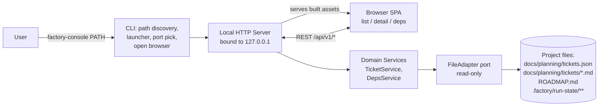

# Architecture — Factory Console

Durable backbone of the project. `/factory-plan-milestone` reads this to elaborate v1 / v2 tickets just-in-time once earlier milestones are built.

## One-line

Single-process local web application: `factory-console` CLI resolves a target project path, boots an embedded HTTP server bound to `127.0.0.1`, opens the default browser, serves a versioned REST API + the pre-built SPA as static assets from the same wheel. No database, no cache, no watcher; every request re-reads project files through a pure `FileAdapter` port.

## Diagram



## SDLC coverage

| Aspect | Status |
|---|---|
| product-vision | in-scope |
| data (DB) | N/A — files are the source of truth |
| backend | in-scope |
| ai/ml | N/A |
| api-contracts | in-scope |
| frontend | in-scope |
| cli / sdk | in-scope |
| auth / security | N/A for MVP — 127.0.0.1 trust boundary; loopback write token added in v2 |
| infra / devops | in-scope |
| observability | in-scope (minimal) |
| testing / quality | in-scope |
| configuration | in-scope |
| documentation | in-scope |

## Tech stack

### Server
- **Python 3.11+** (rationale: matches surrounding factory tooling; stdlib handles JSON/markdown; `uvx`/`pipx` give single-command install; cross-platform).
- **FastAPI** (Uvicorn ASGI) — Pydantic response models double as the shared-types contract; OpenAPI auto-published at `/api/v1/openapi.json`.
- **Typer** — CLI (`factory-console`).
- **pydantic-settings** — config (`FACTORY_CONSOLE_HOST/PORT/LOG_LEVEL`); host validator pinned to loopback.
- **markdown-it-py + mdit-py-plugins + bleach** — server-side rendering + sanitization.
- **PyYAML** — front-matter parsing.

### Frontend
- **SvelteKit** with `adapter-static` in SPA mode (`prerender=false`, `fallback=index.html`). Built to a plain folder that gets copied into the wheel.
- **TypeScript** (strict).
- **Tailwind CSS** (JIT).
- **openapi-typescript** — generates `src/lib/api/types.ts` from `/api/v1/openapi.json`.
- **Vitest** — unit; **Playwright** — e2e.

### Toolchain
- ruff + ruff-format (Python); eslint + prettier (front-end); pre-commit for both.
- GitHub Actions matrix `{ubuntu-latest, macos-latest} × {Python 3.11, 3.12}` — lint + pytest (85% coverage gate) + Vitest + wheel build + smoke install + Playwright e2e.
- Release: tag `vX.Y.Z` → PyPI via OIDC trusted publishing + GitHub Release.
- Multi-stage Dockerfile producing a lean, self-contained image (NOT the primary distribution). Base images use floating major-version tags, so it favors upstream security patches over bit-for-bit reproducibility.

### Rejected alternatives
- Go+chi (fastest cold start; rejected for stack coherence with surrounding factory tooling).
- Node+Fastify (would add a second runtime for users).
- HTML+HTMX (fine for MVP; painful once v1 adds a rendered DAG and v2 adds edit forms).
- PyInstaller single binary (macOS signing pain).

## Data model

No database. Source of truth is the target project's files, modeled as read-through domain entities that live in memory only during a single request.

- **Project** — `{ rootPath, ticketsManifestPath, ticketsDir, roadmapPath|None, runStateDir|None, discoveredAt }`. Constructed once per request.
- **Ticket** — `{ id, title, status, track|None, milestone|None, dependsOn: [str], provides: [str], files: [str], filePath, bodyMarkdown, bodyHtml, raw: dict }`. Joins a manifest entry with its `.md` at `docs/planning/tickets/<id>.md`.
- **TicketSummary** — list projection: `{ id, title, status, track, milestone, runState, depCount, dependentCount }`.
- **RunState** — enum, derived from the project's resolved run-state **source** (`.factory/run-state.json` in preference to the marker directory — see "Factory run-state directory" below, whose addenda are normative for HOW each member is resolved). Members: the four directory-form states `{ todo, in_flight, ready, merged }`; the six further factory statuses `{ in_progress, in_part, in_submilestone, flagged, failed, needs_human }` (T78, JSON form only); and the three "no state was read" answers `{ unknown, absent, unreadable }` (T80), which are the ones the write gates discriminate on. Single source of truth: `factory_console.domain.run_state.RunState`; the SPA's union is generated from it, never hand-maintained.
- **DepNeighborhood** — `{ ticket, directDeps, directDependents, unresolvedDeps }`. Dependents computed by reverse-indexing `dependsOn` per request.
- **Roadmap** — `{ path, bodyMarkdown, bodyHtml }` — MVP detects presence; v1 renders full body.

**Schema tolerance (manifest)**: unknown fields preserved on `Ticket.raw`; missing optionals default sensibly; `schemaVersion` (if the factory writes one) surfaced but not enforced in v0. Forward-compat with future factory versions without coordinated release.

**Ticket-id constraint**: `^[A-Za-z0-9_.-]+$` — single source of truth at `factory_console.domain.ticket.TICKET_ID_PATTERN`. Enforced at Pydantic model boundary AND defense-in-depth in `file_adapter/ticket_md.py`.

## Contracts

### REST v1
Base: `http://127.0.0.1:<port>/api/v1`. JSON camelCase, ISO-8601, errors as `{ error: { code, message, details? } }` with proper HTTP status.

- `GET /api/v1/project` → `Project`.
- `GET /api/v1/tickets` → `{ items: TicketSummary[], total }` with optional `?status=&track=&milestone=&q=` filters (server-side).
- `GET /api/v1/tickets/{id}` → `Ticket` (includes rendered `bodyHtml` + resolved `runState`).
- `GET /api/v1/tickets/{id}/deps` → `DepNeighborhood`.
- `GET /api/v1/search?q=&limit=` → `{ items: SearchHit[], total }` — full-text over id/title/`provides`/body (distinct from the `tickets?q=` id+title filter); blank `q` → empty; `limit` 1–200, default 50.
- `GET /api/v1/roadmap` → `Roadmap | { present: false }` — the full rendered body (`bodyMarkdown` + `bodyHtml`) plus structured `milestones[]`, or the `{ present: false }` envelope when the project has no roadmap.
- `GET /api/v1/graph` → `TicketGraph` (`{ nodes, edges }`) — the whole-project run-state-coloured dependency DAG; one node per ticket, one edge per resolved `dependsOn` (self-loops and dangling ids omitted).
- `GET /api/v1/health` → `{ ok, version, projectRoot }`.
- `GET /api/v1/openapi.json` — auto-generated schema; SPA regenerates TS types from it.

Versioning: URL-prefixed `/api/v1/`. Breaking changes → `/api/v2/` with a deprecation window.

### FileAdapter port
Python `Protocol`, read-only, eight methods (all but `load_project` take a `Project`):
- `load_project(root: Path) → Project`
- `list_tickets(project) → list[TicketSummary]`
- `get_ticket(project, ticket_id) → Ticket | None`
- `get_deps(project, ticket_id) → DepNeighborhood | None`
- `read_run_state(project, ticket_id) → RunState`
- `get_roadmap(project) → Roadmap | None`
- `search_tickets(project, query, *, limit=None) → list[SearchHit]` (best-first; blank query → `[]`)
- `get_graph(project) → TicketGraph` (whole-project run-state-coloured dependency DAG; resolved-only edges, self-loops and dangling ids omitted)

Two implementations: `RealFileAdapter` (hits real FS) and `FakeFileAdapter` (in-memory for tests). Handlers depend on the Protocol, wired via `FastAPI.Depends()`. This is the seam the file-adapter track owns; backend never touches `open()` directly.

### Factory run-state directory (read-only)
Fallback probe order: `<root>/.factory/run-state/`, then `<root>/docs/planning/.run-state/`. Per-ticket state via marker file or subdirectory:

- `<runStateDir>/todo/<id>`, `<runStateDir>/in-flight/<id>/`, `<runStateDir>/ready/<id>/`, `<runStateDir>/merged/<id>`.

Absence of the run-state dir → all tickets `RunState.unknown`. Present dir but missing marker → `RunState.todo`. The console **MUST NOT** write anything here in v0 or v2. v2's editing gate uses `RunState == todo` (or `unknown`) as the only editable predicate.

> **⚠ SUPERSEDED BY T80 — do not build against the two sentences above.** They are kept verbatim only so the correction can quote what it replaces. As shipped, resolution is three-way, not two: **no source at all → `unknown` (mutable)**; **a resolved but _vacuous_ source → `unknown` (mutable)** — a marker directory holding no marker for any ticket, or a `run-state.json` whose `tickets` object parsed and is empty; **a _populated_ source that does not list this ticket → `absent`**, which is refused an edit but is still **deletable** (`ensure_deletable`, because `create_ticket` is ungated). A **vanished** source — one that is no longer there when probed — resolves `unknown`, never `absent`. There are therefore **two** predicates, not one: `MUTABLE_STATES` for edit and the wider `DELETABLE_STATES` for delete. The console also reads `.factory/run-state.json` in preference to this directory. See `docs/planning/tickets/v2.1/T80-write-gate-absent-vs-unsourced.md`; **T86** rewrites this whole section.
>
> **Addendum (T80 amendment 2) — resolution is four-way.** A source that **exists and cannot be READ** (`EACCES` on a marker directory or its state subdirectories, an I/O error on `run-state.json`) resolves **`unreadable`**, which is in **neither** allowlist: both edit and delete are refused, and the 409 names the source path. It is distinct from `unknown` ("I looked and there is nothing to find" — no source, vanished, vacuous, or content that could not be parsed) and from `absent` ("the source was read and does not list this ticket", which stays deletable), because an unreadable source may be hiding a `merged` marker and a write must never be granted because the check could not run.
>
> **Addendum (T80 amendment 3) — the resolution invariant.** A run-state resolution that **could not read** something it needed must **refuse**; it may never fall back to a state that is *more permissive* than the one it failed to check. "I looked and found nothing" and "I could not look" are different answers, and only the first may return a mutable state. Concretely for the marker directory: the precedence walk (`merged` > `ready` > `in-flight` > `todo`) returns a marker only when every state **at or above** it was readable, so a stale `todo/<id>` under an unreadable `merged/` resolves `unreadable`, not the mutable `todo`. A state directory **below** an answer already read does not change it. The same rule binds source **discovery**: a location that could not be probed becomes the source and refuses, rather than being skipped into "this project has no run-state". *(Superseded in wording by amendment 4 below — the conclusion is unchanged.)*
>
> **Addendum (T80 amendment 4) — the resolution invariant, restated; and `unknown` narrowed to silence.** Amendment 3 said "could not **read**". That misses a case that is not a read failure at all: the file was read fine, we read `status: <value>`, and **could not interpret it**. Looked, saw, did not understand.
>
> > **THE RESOLUTION INVARIANT (restated).** A run-state resolution must refuse whenever the information it needed is **unavailable** — whether because it could not be read, or because it was read and could not be interpreted. It may never fall back to a state *more permissive* than the one it failed to establish.
>
> Concretely: a `run-state.json` entry that names **this** ticket under a `status` outside `FACTORY_STATUS_ALIASES` — or under a non-string `status`, or in an entry that is not an object at all — now resolves **`unreadable`** and is refused **both** writes, where it previously resolved the mutable `unknown`. An unrecognised status is the factory speaking about this ticket in a vocabulary this console does not know; the one thing it is not is silence. The refusal **names the value** (*"the run-state says `in_review`, which this console does not know"*), not "not tracked" and not "could not be read" — the state is shared with amendment 2's cause because the authorization answer is the same, but the remedy differs (upgrade the console vs. fix the source's permissions) and so the message must. The value also still appears in `JsonRunState.unrecognised`: naming the gap and refusing it are both required.
>
> This **narrows `unknown` to "nothing was said"** — no source at all, a source that vanished, a source that lists nobody, and a document whose whole content could not be parsed (so it named no ticket either). Those stay **mutable**; a project with no usable run-state must remain fully usable in the console. The document-level parse failure is the deliberate boundary of this amendment and remains ratified as `unknown` — see the ticket's open item 2, which asks whether it should move too.
>
> **Addendum (T92) — the restated invariant reaches the DIRECTORY form.** Amendment 4 concretised "read and could not be interpreted" only for `run-state.json` statuses. The marker directory has the same gap and it is the last of the family: `_MARKER_PRECEDENCE` (`merged`, `ready`, `in-flight`, `todo`) is the console's **whole vocabulary**, not the factory's, so a state subdirectory outside it — `.factory/run-state/in_review/` once the factory grows a tenth `FAC_STATES` entry — is the factory speaking about a ticket in a vocabulary this console does not know. Three changes, all in `file_adapter/run_state.py`:
>
> 1. **An id NAMED under such a subdirectory resolves `unreadable`**, refused by both gates. **Per id, not per source** — an unrecognised directory that **opens and** names nobody changes nothing, because a misplaced folder must not turn a whole project read-only. Read "names nobody" strictly: a directory that *opened* and held no marker for this id. One that will **not** open is the other case entirely — see amendment 1 below, which is per source.
> 2. **It refuses AHEAD of any recognised marker for the same id**, which amends amendment 3's precedence sentence above: the walk `merged` > `ready` > `in-flight` > `todo` is no longer the complete rule, because a state with no name has no *rank* either — `merged/<id>` can no longer settle the question once `in_review/<id>` might outrank it.
> 3. **Vacuity counts markers under EVERY subdirectory**, not only the four named ones — so the definition in the superseded paragraph above ("a marker directory holding no marker for any ticket") means *any* subdirectory. A source whose markers all live under `in_review/` **lists** tickets; we simply cannot name their states, so ids it does not name stay `absent` rather than becoming the mutable `unknown`.
>
> As in amendment 4, the refusal **names what it could not interpret** — `state 'in_review'`, the directory form's mirror of `status 'in_review'` — so the operator is sent to upgrade the console, not to chmod a path that reads fine. The unrecognised state names are also collected and logged once per scan, the directory form's answer to `JsonRunState.unrecognised`. See `docs/planning/tickets/v2.1/T92-unrecognised-state-directory.md`.
>
> **Addendum (T92 amendment 1) — an UNSEARCHABLE unrecognised subdirectory refuses PER SOURCE.** Item 1 above is per id because it is decided by **reading** the unknown state directory. A directory that was **discovered and will not open** — `.factory/run-state/in_review/` mode `0700` under the factory's uid, so the run-state dir lists fine while stat'ing anything inside it raises — cannot be enumerated, so **no id in that source can be ruled out of it**. It therefore resolves `unreadable` for **every id in the source**, and, exactly as in item 2, **ahead of any recognised marker**: a `todo/<id>` this console can read cannot outrank a state whose rank is unknown.
>
> This is not a widening of the over-refusal guard in item 1, it is the guard's boundary. That guard protects a directory that names **nobody** — empty, and readable enough to *know* it is empty. **An unsearchable directory is not empty, it is unknown**, which is amendment 4's absent-is-not-empty distinction one level out. So a project whose run-state directory holds an unsearchable subdirectory does go read-only until a human fixes the permissions, and that is the intended outcome: the console cannot establish who owns those tickets and must not edit tickets a lane may own. It is also loud, which the fail-open it replaces was not — and a refusal is recoverable with one `chmod`, while an unnoticed write to a ticket the factory has moved on from is not.
>
> The remedy differs from item 1's, so the message must too: this refusal **names the directory it could not search** and says it **could not be looked in** — as shipped, `run-state: <dir> holds state 'in_review', which this console could not look in`. Never "does not know" (that sends the operator to upgrade a console when the fix is a permission bit) and never "could not be enumerated" (that sends them to chmod a run-state directory that enumerated fine). Because nothing was *read*, there is no value to quote, so the name is carried in the operator-facing **log** rather than in `TicketNotMutable`'s reason — that field phrases "your console is a version behind the factory", which would be false here. See the ticket's "Amendment 1" section.
>
> **Addendum (T92 amendment 2) — MONOTONICITY, the property every rule above is an instance of.** T80 took four amendments to close six cases and T92 took two to find three more, each stated as a rule about a *situation* — an unreadable source, a looping directory, an unclassifiable status, an unsearchable directory. Situations are unbounded, so that list never closes. Stated as a property of the resolution function instead, it does:
>
> > **MONOTONICITY. Resolution must be monotone in information: if input A reveals strictly less than input B, A's answer must be *no more permissive* than B's. There is no filesystem state so degraded that it grants access a better-understood state would refuse.**
>
> Every addendum above is a corollary of it, and two answers changed to satisfy it:
>
> 1. **A run-state directory entry whose `stat` FAILED is recorded, never dropped.** A symlink loop at `.factory/run-state/in_review` raises `ELOOP` (deliberately not an "absent" errno), and the entry used to be discarded from the unrecognised set — so it was never probed for any id and a stale readable `todo/<id>` still resolved the **mutable** `todo`. Dropping is the sharpest instance of the failure: discarding what could not be read leaves a collection that looks *smaller and cleaner*, which reads downstream as **more** information, not less. It is now recorded as an unrecognised state name, where the existing machinery refuses it per source exactly as amendment 1's unsearchable directory does. The REFUSAL needs no new branch, but the **message does**, and it is the family's third: an entry that would not `stat` has not been shown to be a state directory, nor to carry a name this console merely lacks, so it says it **could not be identified** — `run-state: <dir> holds an entry 'in_review' this console could not identify` — and never "does not know", which would send an operator to upgrade a console when the fix is a symlink loop or a permission bit.
> 2. **A run-state directory that cannot be ENUMERATED refuses every id in the source**, ahead of the marker walk, where a readable `todo/<id>` used to answer. That residual was documented as deliberate and it was non-monotonic: a directory that will not *list* reveals strictly less than one that lists fine while holding a subdirectory that will not *open*, yet the first was answering markers while the second (amendment 1) refuses everything. Its refusal **names no subdirectory** — the listing that would have produced a name is what failed — so the message points at the run-state directory itself and says it **could not be enumerated**, the one wording amendment 1 forbids for its own case, and for the mirror-image reason.
>
> The enumeration this amendment requires — every resolution path verdicted against *"is there a strictly-less-informative input that produces a strictly-more-permissive output?"* — is stated in the PR body, per the ticket's "Required before any further review round". See the ticket's "Amendment 2" section.

### CLI contract
```
factory-console [PATH] [--port N] [--host 127.0.0.1] [--no-browser] [--log-level LEVEL] [--version]
```
- Exit codes: `0` ok · `1` project-not-found · `2` port-in-use · `3` malformed manifest.
- Path resolution: `PATH` arg wins; else walk up from cwd looking for `docs/planning/tickets.json`.
- On success: `Factory Console vX.Y.Z — serving <root> at http://127.0.0.1:<port>` on stdout, then (unless `--no-browser`) opens the URL.

## Cross-cutting

- **Config**: pydantic-settings. Env prefix `FACTORY_CONSOLE_`. `host` field-validator refuses anything not in `{127.0.0.1, localhost, ::1}`.
- **Logging**: stdlib logging, one line per request `LEVEL ts method path status dur_ms`; `--log-level` flag; stderr only.
- **Errors**: single `errors.py` defines `FactoryConsoleError` base + `to_error_response(exc)`. Concrete subclasses live in the modules that raise them (`file_adapter/*`, `services/*`). Backend registers ONE FastAPI exception handler catching `FactoryConsoleError` + a `RequestValidationError` handler that special-cases `TICKET_ID_PATTERN` violations to emit `{ status: 400, code: 'invalid_ticket_id' }` (uniform with `PathTraversal` from ticket_md).
- **Auth**: N/A in v0 — 127.0.0.1 binding is the trust boundary. No cookies, no CORS (same-origin), no CSRF (no state changes). v2 writes add a per-session loopback token.
- **Input validation**: Pydantic at every boundary; ticket-id regex enforced defense-in-depth in `_safe_resolve`.
- **Concurrency**: single-worker Uvicorn. No locks (no writes in MVP).

## DevOps

- **Single-command launch**: `uvx factory-console` or `pipx install factory-console && factory-console`. Wheel embeds the pre-built SPA under `factory_console/_static/` — no Node dependency at runtime.
- **Dev loop**: `scripts/dev.sh` runs Uvicorn `--reload` alongside Vite dev; Vite proxies `/api/*` to the Python port. `factory_console.app:create_dev_app` is the zero-arg factory Uvicorn boots.
- **Packaging**: `scripts/package.sh` builds SPA → copies to `_static/` → `python -m build`.
- **Dockerfile**: multi-stage (node builder → python builder → thin runtime) producing a lean, self-contained image. Not the primary distribution; uses floating major-version base tags (patches over bit-for-bit reproducibility).
- **CI**: matrix over `{ubuntu-latest, macos-latest} × {Python 3.11, 3.12}` — lint, pytest, Vitest, wheel build, smoke install, Playwright e2e. Concurrency group cancels stale runs.
- **Release**: tag `vX.Y.Z` → PyPI via OIDC trusted publishing + GitHub Release (wheel + sdist attached).
- **Environments**: dev (source checkout, hot reload) + prod (installed wheel). No staging, no cloud.

## Testing strategy

- **Unit (Python)** — pure functions in `file_adapter/` (manifest, ticket .md, discovery, run-state) against `tmp_path` fixtures; `services/` against `FakeFileAdapter`. Target >90% on `file_adapter/` + `services/`. Overall gate 85%.
- **Integration (Python)** — `httpx.AsyncClient` against the FastAPI app with `FakeFileAdapter` for happy paths and `RealFileAdapter` against `tests/fixtures/projects/*` for realism.
- **CLI integration** — subprocess-launch `factory-console` on a fixture, parse printed port, hit `/health`, SIGINT, assert clean exit.
- **Frontend unit (Vitest)** — components render given fixture props; store logic covered.
- **E2E (Playwright)** — boots the packaged CLI on `tests/fixtures/projects/with_run_state/`, drives a real browser through list → filter → click ticket → see body + deps + run-state → click a dep. This IS the MVP acceptance harness.
- **Fixtures as contract** — `tests/fixtures/projects/` doubles as executable docs of supported project shapes.

## v3 — Hosted multi-project control plane (additive on the hexagonal core)

Planned expansion, elaborated into tickets just-in-time via `/factory-plan-milestone v3` once v2 is
built. The change is **additive**: new adapters + a hosting/auth shell around the existing
domain/ports — no domain rewrite. Every read still flows through the source-agnostic domain
(`Project` / `Ticket` / `RunState` / `DepNeighborhood`).

- **Console-owned store (NEW):** SQLite at `~/.factory-console/console.db`, holding **only** the
  console's own state — `projects(id, name, path, added_at)` + `credentials(username, password_hash)`.
  Tickets / run-state / roadmap are **never** copied into it; they stay read-through from each
  project's files. (A flat file would suffice; SQLite is chosen so a later audit log / multi-user need
  no migration.)
- **Project resolution (CHANGED):** today one `Project` is fixed at boot from cwd and served for the
  process's life. v3 resolves the *selected* project per request from the registry (single-user = a
  server-side "current selection"). The domain/services already accept a `Project` argument, so this is
  a resolution change, not a rewrite. The future all-projects dashboard is the same per-project reads
  looped over the registry.
- **Serve mode + bind (CHANGED):** new `factory-console serve` long-running mode. The loopback-pinned
  `host` validator relaxes to allow a configured bind (a tailnet address), gated so a casual
  `factory-console PATH` still stays loopback-only.
- **Auth (NEW):** single username/password; password hashed (argon2/bcrypt); session cookie
  (HttpOnly, Secure, SameSite). Required for `serve` mode; the local viewer mode stays auth-free
  (loopback trust).
- **Access / deploy:** **Tailscale-first** — the console binds to a private tailnet, reachable from the
  user's phone + laptop with no public exposure, no TLS/proxy, and no login-hardening burden.
  **Public-with-TLS** (reverse proxy + Let's Encrypt + hardened login) is a later *deploy-time* option
  — **no app code change**; the bind host is configuration.
- **GitHubAdapter (NEW, read-only):** per-project PR status + links via **guard-scoped `gh`** (respects
  the dual-account pin). A new port alongside `FileAdapter`; read-only, never mutates GitHub.
- **Open-Claude launcher (LATER / optional — pending mechanism confirmation):** a per-project action
  that spawns `claude` in the project directory (tmux-wrapped for persistence). Interactive control
  happens through Claude Code's **own** remote control from the user's device — **not** a web PTY, so
  the console never exposes a shell. This is the console's only privileged write. Requires confirming
  Claude Code can attach to a server-started session; skippable if viewing-only suffices.

### Data-model additions (v3)
- **RegisteredProject** — `{ id, name, path, addedAt }` (a console-DB row) — distinct from the
  read-through `Project` entity.
- **Credentials / Session** — auth state (console DB / in-memory).

### Cross-cutting deltas (v3)
- **Auth:** v0 = loopback trust · v2 = loopback write token · **v3 = username/password + session for
  serve mode.**
- **Concurrency:** serve mode is long-running + multi-client; reads stay read-through per request; the
  console DB is the only writable state (SQLite handles its own locking).
