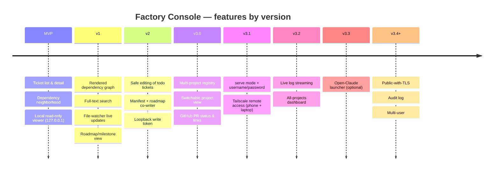

# Roadmap — Factory Console

Rolling wave: MVP fully ticketed; v1–v3 are epic-level until elaborated just-in-time.

## At a glance — features by version

## MVP — read-only browsing

`uvx factory-console` in any App-Factory project → browser tab in <5s → list + detail + dep-neighborhood. Single-command launch, 127.0.0.1-only, no writes, wheel on PyPI, CI green.

Build tickets in dependency order:

- [ ] **T01** — Monorepo skeleton (dirs, LICENSE, .gitignore, README stub, .python-version) → `/ai-gh-orchestrate-plan docs/planning/tickets/mvp/T01-monorepo-skeleton.md`
- [ ] **T02** — Python package skeleton + pyproject.toml + factory-console entry point → `/ai-gh-orchestrate-plan docs/planning/tickets/mvp/T02-python-package-skeleton.md`
- [ ] **T03** — Frontend skeleton (SvelteKit + Tailwind + Vitest + Playwright + openapi-typescript) → `/ai-gh-orchestrate-plan docs/planning/tickets/mvp/T03-frontend-skeleton.md`
- [ ] **T04** — Observability skeleton (logging.py + errors.py base + config.py) → `/ai-gh-orchestrate-plan docs/planning/tickets/mvp/T04-observability-skeleton.md`
- [ ] **T05** — Pre-commit config (ruff + ruff-format + eslint + prettier) → `/ai-gh-orchestrate-plan docs/planning/tickets/mvp/T05-pre-commit-config.md`
- [ ] **T06** — Walking-skeleton FastAPI app + trivial Typer CLI + /api/v1/health → `/ai-gh-orchestrate-plan docs/planning/tickets/mvp/T06-walking-skeleton-app.md`
- [ ] **T07** — Domain models + TICKET_ID_PATTERN → `/ai-gh-orchestrate-plan docs/planning/tickets/mvp/T07-domain-models.md`
- [ ] **T08** — Fixture projects (minimal, with_run_state, malformed) → `/ai-gh-orchestrate-plan docs/planning/tickets/mvp/T08-fixture-projects.md`
- [ ] **T09** — Dev + package scripts + Makefile → `/ai-gh-orchestrate-plan docs/planning/tickets/mvp/T09-dev-and-package-scripts.md`
- [ ] **T10** — FileAdapter Protocol + FakeFileAdapter → `/ai-gh-orchestrate-plan docs/planning/tickets/mvp/T10-file-adapter-protocol-and-fake.md`
- [ ] **T11** — Upward-walk project discovery → `/ai-gh-orchestrate-plan docs/planning/tickets/mvp/T11-project-discovery.md`
- [ ] **T12** — tickets.json manifest parser → `/ai-gh-orchestrate-plan docs/planning/tickets/mvp/T12-manifest-parser.md`
- [ ] **T13** — Ticket .md + front-matter parser → `/ai-gh-orchestrate-plan docs/planning/tickets/mvp/T13-ticket-md-parser.md`
- [ ] **T14** — Server-side markdown renderer → `/ai-gh-orchestrate-plan docs/planning/tickets/mvp/T14-markdown-renderer.md`
- [ ] **T15** — Run-state directory prober (read-only) → `/ai-gh-orchestrate-plan docs/planning/tickets/mvp/T15-run-state-prober.md`
- [ ] **T16** — Multi-stage Dockerfile for reproducible builds → `/ai-gh-orchestrate-plan docs/planning/tickets/mvp/T16-dockerfile.md`
- [ ] **T17** — RealFileAdapter composing all parsers → `/ai-gh-orchestrate-plan docs/planning/tickets/mvp/T17-real-file-adapter.md`
- [ ] **T18** — CI workflow (matrix lint + tests + build + smoke; conditional e2e) → `/ai-gh-orchestrate-plan docs/planning/tickets/mvp/T18-ci-workflow.md`
- [ ] **T19** — Docs skeleton (architecture.md + usage.md + contributing.md) + README quickstart → `/ai-gh-orchestrate-plan docs/planning/tickets/mvp/T19-docs-skeleton.md`
- [ ] **T20** — App-factory rewrite (create_app + create_dev_app + DI + error handlers) → `/ai-gh-orchestrate-plan docs/planning/tickets/mvp/T20-app-factory-rewrite.md`
- [ ] **T21** — Project endpoint (GET /api/v1/project) + OpenAPI publish → `/ai-gh-orchestrate-plan docs/planning/tickets/mvp/T21-project-endpoint.md`
- [ ] **T22** — Tickets list + detail endpoints + TicketService → `/ai-gh-orchestrate-plan docs/planning/tickets/mvp/T22-tickets-endpoints.md`
- [ ] **T23** — Deps endpoint + DepsService → `/ai-gh-orchestrate-plan docs/planning/tickets/mvp/T23-deps-endpoint.md`
- [ ] **T24** — Roadmap endpoint + relocated + enriched health handler → `/ai-gh-orchestrate-plan docs/planning/tickets/mvp/T24-roadmap-and-health-endpoints.md`
- [ ] **T25** — CLI extension: discovery + port + browser + signals + exit codes → `/ai-gh-orchestrate-plan docs/planning/tickets/mvp/T25-cli-extension.md`
- [ ] **T26** — Release workflow (tag vX.Y.Z → PyPI via OIDC) → `/ai-gh-orchestrate-plan docs/planning/tickets/mvp/T26-release-workflow.md`
- [ ] **T27** — SPA shell + routing + Tailwind base + global error page → `/ai-gh-orchestrate-plan docs/planning/tickets/mvp/T27-spa-shell.md`
- [ ] **T28** — API client + generated TS types (openapi-typescript) → `/ai-gh-orchestrate-plan docs/planning/tickets/mvp/T28-api-client-and-types.md`
- [ ] **T29** — Shared components: StatusBadge, RunStateBadge, MarkdownBody → `/ai-gh-orchestrate-plan docs/planning/tickets/mvp/T29-shared-components.md`
- [ ] **T30** — Ticket list route `/` with server-side filter + search → `/ai-gh-orchestrate-plan docs/planning/tickets/mvp/T30-ticket-list-route.md`
- [ ] **T31** — Ticket detail route `/tickets/[id]` → `/ai-gh-orchestrate-plan docs/planning/tickets/mvp/T31-ticket-detail-route.md`
- [ ] **T32** — Dep neighborhood route `/tickets/[id]/deps` → `/ai-gh-orchestrate-plan docs/planning/tickets/mvp/T32-dep-neighborhood-route.md`
- [ ] **T33** — Playwright e2e harness (config + global setup/teardown + happy-path spec) → `/ai-gh-orchestrate-plan docs/planning/tickets/mvp/T33-playwright-harness.md`
- [ ] **T34** — README screenshots pipeline → `/ai-gh-orchestrate-plan docs/planning/tickets/mvp/T34-screenshots-pipeline.md`
- [ ] **T35** — Tighten CI: unconditional Playwright + coverage gate at 85% → `/ai-gh-orchestrate-plan docs/planning/tickets/mvp/T35-ci-tightening.md`

## v1 — richer read + navigation

Still read-only, single-process, 127.0.0.1. Adds a dependency-graph view, a roadmap/milestone view, cross-ticket full-text search, and a watchdog-backed live-update channel (the one deliberate extension of the MVP's watcher-free model). Build in dependency order — read layer → API → SPA → e2e:

- [ ] **T36** — Full-text search capability behind the FileAdapter port → `/ai-gh-orchestrate-plan docs/planning/tickets/v1/T36-full-text-search-capability.md`
- [ ] **T37** — Dependency graph (DAG) projection behind the FileAdapter port → `/ai-gh-orchestrate-plan docs/planning/tickets/v1/T37-dependency-graph-projection.md`
- [ ] **T38** — Structured roadmap parse (milestones + checkbox state) → `/ai-gh-orchestrate-plan docs/planning/tickets/v1/T38-structured-roadmap-parse.md`
- [ ] **T39** — FileWatcher port + ChangeEvent + deterministic FakeFileWatcher → `/ai-gh-orchestrate-plan docs/planning/tickets/v1/T39-file-watcher-port.md`
- [ ] **T40** — watchdog-backed RealFileWatcher over docs/planning/** + .factory/run-state/** → `/ai-gh-orchestrate-plan docs/planning/tickets/v1/T40-watchdog-real-file-watcher.md`
- [ ] **T41** — GET /api/v1/search endpoint + SearchService → `/ai-gh-orchestrate-plan docs/planning/tickets/v1/T41-search-endpoint.md`
- [ ] **T42** — GET /api/v1/graph endpoint + GraphService → `/ai-gh-orchestrate-plan docs/planning/tickets/v1/T42-graph-endpoint.md`
- [ ] **T43** — Widen GET /api/v1/roadmap to full body + structured milestones → `/ai-gh-orchestrate-plan docs/planning/tickets/v1/T43-roadmap-endpoint-widen.md`
- [ ] **T44** — Wire the FileWatcher lifecycle into create_app (inject + lifespan + DI) → `/ai-gh-orchestrate-plan docs/planning/tickets/v1/T44-file-watcher-lifecycle.md`
- [ ] **T45** — GET /api/v1/events SSE endpoint + EventsService → `/ai-gh-orchestrate-plan docs/planning/tickets/v1/T45-events-sse-endpoint.md`
- [ ] **T46** — Extend the typed api client for the v1 read endpoints → `/ai-gh-orchestrate-plan docs/planning/tickets/v1/T46-typed-api-client.md`
- [ ] **T47** — /graph route — Cytoscape dependency DAG (bundled) → `/ai-gh-orchestrate-plan docs/planning/tickets/v1/T47-graph-route.md`
- [ ] **T48** — /roadmap route — full body + structured milestones → `/ai-gh-orchestrate-plan docs/planning/tickets/v1/T48-roadmap-route.md`
- [ ] **T49** — Global TopBar nav + search box + /search route → `/ai-gh-orchestrate-plan docs/planning/tickets/v1/T49-topbar-nav-and-search.md`
- [ ] **T50** — SSE live updates — subscribe to /api/v1/events + refresh view → `/ai-gh-orchestrate-plan docs/planning/tickets/v1/T50-sse-live-updates.md`
- [ ] **T51** — Graph-render e2e (DAG renders, run-state colors, click-through) → `/ai-gh-orchestrate-plan docs/planning/tickets/v1/T51-graph-e2e.md`
- [ ] **T52** — Search e2e (full-text results, links, empty state) → `/ai-gh-orchestrate-plan docs/planning/tickets/v1/T52-search-e2e.md`
- [ ] **T53** — Live-update e2e + dedicated mutable-console harness → `/ai-gh-orchestrate-plan docs/planning/tickets/v1/T53-live-update-e2e.md`
- [ ] **T54** — v1 docs + README screenshots refresh → `/ai-gh-orchestrate-plan docs/planning/tickets/v1/T54-docs-screenshots-refresh.md`

## v2 — safe editing of todo tickets (epic-level)

`in_flight` / `ready` / `merged` tickets remain read-only (matching how `/factory-reconcile-plan` treats them).

- `FileWriter` port symmetric to `FileAdapter` + `RunStateGate` enforcing todo-only mutability.
- Manifest + markdown + roadmap co-writer (`tmp-write + rename`) with dry-run diff.
- `POST /api/v1/tickets` (create), `PUT /api/v1/tickets/{id}` (edit), `DELETE /api/v1/tickets/{id}` endpoints.
- SPA edit form (CodeMirror/monaco) with live validation, disabled state + banner for non-todo tickets, diff-preview modal, save+confirm.
- Loopback-only write token (per-session, printed to stderr, sent as header).
- Signed releases + sigstore attestations.
- Property-based tests ensuring no write mutates a non-todo ticket; e2e for create/edit/save.

→ Elaborate later with `/factory-plan-milestone v2`.

## v3 — Mission control: hosted multi-project console (epic-level)

Graduates from a local single-project viewer into a long-running, **Tailscale-reachable** service
managing many imported projects. Files stay the source of truth; a tiny SQLite store holds only the
console's own registry + credentials. Staged so each slice is usable on its own:

- **v3.0 — Multi-project read plane (local):** SQLite project registry; add/select project; switchable
  single-project view (today's console + a project dropdown); `GitHubAdapter` for PR status + links.
  Still `127.0.0.1`.
- **v3.1 — Hosting + auth:** `factory-console serve` mode; configurable bind; single username/password
  login (hashed + session cookie); Tailscale deploy doc → reachable from phone + laptop.
- **v3.2 — Live + dashboard:** factory loop/QA **log streaming** (reuses the v1 `FileWatcher` port);
  all-projects **dashboard** homepage (progress %, current milestone, open PRs across projects).
- **v3.3 — (optional) Open-Claude launcher:** per-project button spawning `claude` (tmux) for
  phone-driven work; pending confirmation that Claude Code can attach to a server-started session.
- **v3.4+ — Hardening options:** public-with-TLS deploy path; audit log; multi-user; PR caching.

→ Elaborate later with `/factory-plan-milestone v3` (after v2 is built), continuing the global ticket
IDs — never renumbering existing ones.
