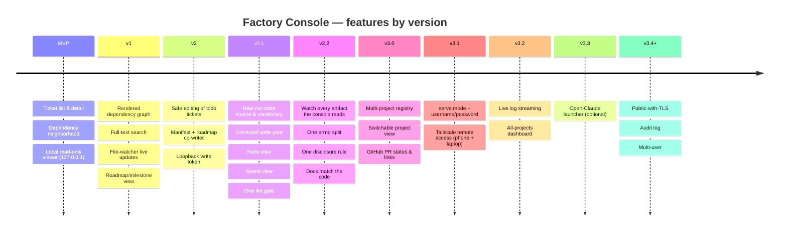

# Roadmap — Factory Console

Rolling wave: MVP fully ticketed; v1–v3 are epic-level until elaborated just-in-time.

> **Checkbox meaning, and a warning about it.** `- [x]` means the Ticket's `.factory/run-state.json`
> entry reads `merged` — nothing else. The boxes were **derived from run-state on 2026-08-05**, when
> it was noticed that all 92 of them were unticked across four completed milestones: 90 Tickets had
> merged and this page, which the console's own `/roadmap` view renders, showed the project as
> entirely unbuilt.
>
> **Nothing keeps them current.** They were wrong for four milestones because ticking a box is a
> manual step nobody owns, and re-deriving them by hand is the same manual step with a longer gap
> before the next drift. The durable fix is for the roadmap view to read run-state directly, or for
> a check to fail when a `merged` Ticket has an unticked box — not for someone to remember. Until
> one of those exists, treat these boxes as a snapshot with a date on it, and run-state as the
> authority.

## At a glance — features by version

## MVP — read-only browsing

`uvx factory-console` in any App-Factory project → browser tab in <5s → list + detail + dep-neighborhood. Single-command launch, 127.0.0.1-only, no writes, wheel on PyPI, CI green.

Build tickets in dependency order:

- [x] **T01** — Monorepo skeleton (dirs, LICENSE, .gitignore, README stub, .python-version) → `/ai-gh-orchestrate-plan docs/planning/tickets/mvp/T01-monorepo-skeleton.md`
- [x] **T02** — Python package skeleton + pyproject.toml + factory-console entry point → `/ai-gh-orchestrate-plan docs/planning/tickets/mvp/T02-python-package-skeleton.md`
- [x] **T03** — Frontend skeleton (SvelteKit + Tailwind + Vitest + Playwright + openapi-typescript) → `/ai-gh-orchestrate-plan docs/planning/tickets/mvp/T03-frontend-skeleton.md`
- [x] **T04** — Observability skeleton (logging.py + errors.py base + config.py) → `/ai-gh-orchestrate-plan docs/planning/tickets/mvp/T04-observability-skeleton.md`
- [x] **T05** — Pre-commit config (ruff + ruff-format + eslint + prettier) → `/ai-gh-orchestrate-plan docs/planning/tickets/mvp/T05-pre-commit-config.md`
- [x] **T06** — Walking-skeleton FastAPI app + trivial Typer CLI + /api/v1/health → `/ai-gh-orchestrate-plan docs/planning/tickets/mvp/T06-walking-skeleton-app.md`
- [x] **T07** — Domain models + TICKET_ID_PATTERN → `/ai-gh-orchestrate-plan docs/planning/tickets/mvp/T07-domain-models.md`
- [x] **T08** — Fixture projects (minimal, with_run_state, malformed) → `/ai-gh-orchestrate-plan docs/planning/tickets/mvp/T08-fixture-projects.md`
- [x] **T09** — Dev + package scripts + Makefile → `/ai-gh-orchestrate-plan docs/planning/tickets/mvp/T09-dev-and-package-scripts.md`
- [x] **T10** — FileAdapter Protocol + FakeFileAdapter → `/ai-gh-orchestrate-plan docs/planning/tickets/mvp/T10-file-adapter-protocol-and-fake.md`
- [x] **T11** — Upward-walk project discovery → `/ai-gh-orchestrate-plan docs/planning/tickets/mvp/T11-project-discovery.md`
- [x] **T12** — tickets.json manifest parser → `/ai-gh-orchestrate-plan docs/planning/tickets/mvp/T12-manifest-parser.md`
- [x] **T13** — Ticket .md + front-matter parser → `/ai-gh-orchestrate-plan docs/planning/tickets/mvp/T13-ticket-md-parser.md`
- [x] **T14** — Server-side markdown renderer → `/ai-gh-orchestrate-plan docs/planning/tickets/mvp/T14-markdown-renderer.md`
- [x] **T15** — Run-state directory prober (read-only) → `/ai-gh-orchestrate-plan docs/planning/tickets/mvp/T15-run-state-prober.md`
- [x] **T16** — Multi-stage Dockerfile for reproducible builds → `/ai-gh-orchestrate-plan docs/planning/tickets/mvp/T16-dockerfile.md`
- [x] **T17** — RealFileAdapter composing all parsers → `/ai-gh-orchestrate-plan docs/planning/tickets/mvp/T17-real-file-adapter.md`
- [x] **T18** — CI workflow (matrix lint + tests + build + smoke; conditional e2e) → `/ai-gh-orchestrate-plan docs/planning/tickets/mvp/T18-ci-workflow.md`
- [x] **T19** — Docs skeleton (architecture.md + usage.md + contributing.md) + README quickstart → `/ai-gh-orchestrate-plan docs/planning/tickets/mvp/T19-docs-skeleton.md`
- [x] **T20** — App-factory rewrite (create_app + create_dev_app + DI + error handlers) → `/ai-gh-orchestrate-plan docs/planning/tickets/mvp/T20-app-factory-rewrite.md`
- [x] **T21** — Project endpoint (GET /api/v1/project) + OpenAPI publish → `/ai-gh-orchestrate-plan docs/planning/tickets/mvp/T21-project-endpoint.md`
- [x] **T22** — Tickets list + detail endpoints + TicketService → `/ai-gh-orchestrate-plan docs/planning/tickets/mvp/T22-tickets-endpoints.md`
- [x] **T23** — Deps endpoint + DepsService → `/ai-gh-orchestrate-plan docs/planning/tickets/mvp/T23-deps-endpoint.md`
- [x] **T24** — Roadmap endpoint + relocated + enriched health handler → `/ai-gh-orchestrate-plan docs/planning/tickets/mvp/T24-roadmap-and-health-endpoints.md`
- [x] **T25** — CLI extension: discovery + port + browser + signals + exit codes → `/ai-gh-orchestrate-plan docs/planning/tickets/mvp/T25-cli-extension.md`
- [x] **T26** — Release workflow (tag vX.Y.Z → PyPI via OIDC) → `/ai-gh-orchestrate-plan docs/planning/tickets/mvp/T26-release-workflow.md`
- [x] **T27** — SPA shell + routing + Tailwind base + global error page → `/ai-gh-orchestrate-plan docs/planning/tickets/mvp/T27-spa-shell.md`
- [x] **T28** — API client + generated TS types (openapi-typescript) → `/ai-gh-orchestrate-plan docs/planning/tickets/mvp/T28-api-client-and-types.md`
- [x] **T29** — Shared components: StatusBadge, RunStateBadge, MarkdownBody → `/ai-gh-orchestrate-plan docs/planning/tickets/mvp/T29-shared-components.md`
- [x] **T30** — Ticket list route `/` with server-side filter + search → `/ai-gh-orchestrate-plan docs/planning/tickets/mvp/T30-ticket-list-route.md`
- [x] **T31** — Ticket detail route `/tickets/[id]` → `/ai-gh-orchestrate-plan docs/planning/tickets/mvp/T31-ticket-detail-route.md`
- [x] **T32** — Dep neighborhood route `/tickets/[id]/deps` → `/ai-gh-orchestrate-plan docs/planning/tickets/mvp/T32-dep-neighborhood-route.md`
- [x] **T33** — Playwright e2e harness (config + global setup/teardown + happy-path spec) → `/ai-gh-orchestrate-plan docs/planning/tickets/mvp/T33-playwright-harness.md`
- [x] **T34** — README screenshots pipeline → `/ai-gh-orchestrate-plan docs/planning/tickets/mvp/T34-screenshots-pipeline.md`
- [x] **T35** — Tighten CI: unconditional Playwright + coverage gate at 85% → `/ai-gh-orchestrate-plan docs/planning/tickets/mvp/T35-ci-tightening.md`

## v1 — richer read + navigation

Still read-only, single-process, 127.0.0.1. Adds a dependency-graph view, a roadmap/milestone view, cross-ticket full-text search, and a watchdog-backed live-update channel (the one deliberate extension of the MVP's watcher-free model). Build in dependency order — read layer → API → SPA → e2e:

- [x] **T36** — Full-text search capability behind the FileAdapter port → `/ai-gh-orchestrate-plan docs/planning/tickets/v1/T36-full-text-search-capability.md`
- [x] **T37** — Dependency graph (DAG) projection behind the FileAdapter port → `/ai-gh-orchestrate-plan docs/planning/tickets/v1/T37-dependency-graph-projection.md`
- [x] **T38** — Structured roadmap parse (milestones + checkbox state) → `/ai-gh-orchestrate-plan docs/planning/tickets/v1/T38-structured-roadmap-parse.md`
- [x] **T39** — FileWatcher port + ChangeEvent + deterministic FakeFileWatcher → `/ai-gh-orchestrate-plan docs/planning/tickets/v1/T39-file-watcher-port.md`
- [x] **T40** — watchdog-backed RealFileWatcher over docs/planning/** + .factory/run-state/** → `/ai-gh-orchestrate-plan docs/planning/tickets/v1/T40-watchdog-real-file-watcher.md`
- [x] **T41** — GET /api/v1/search endpoint + SearchService → `/ai-gh-orchestrate-plan docs/planning/tickets/v1/T41-search-endpoint.md`
- [x] **T42** — GET /api/v1/graph endpoint + GraphService → `/ai-gh-orchestrate-plan docs/planning/tickets/v1/T42-graph-endpoint.md`
- [x] **T43** — Widen GET /api/v1/roadmap to full body + structured milestones → `/ai-gh-orchestrate-plan docs/planning/tickets/v1/T43-roadmap-endpoint-widen.md`
- [x] **T44** — Wire the FileWatcher lifecycle into create_app (inject + lifespan + DI) → `/ai-gh-orchestrate-plan docs/planning/tickets/v1/T44-file-watcher-lifecycle.md`
- [x] **T45** — GET /api/v1/events SSE endpoint + EventsService → `/ai-gh-orchestrate-plan docs/planning/tickets/v1/T45-events-sse-endpoint.md`
- [x] **T46** — Extend the typed api client for the v1 read endpoints → `/ai-gh-orchestrate-plan docs/planning/tickets/v1/T46-typed-api-client.md`
- [x] **T47** — /graph route — Cytoscape dependency DAG (bundled) → `/ai-gh-orchestrate-plan docs/planning/tickets/v1/T47-graph-route.md`
- [x] **T48** — /roadmap route — full body + structured milestones → `/ai-gh-orchestrate-plan docs/planning/tickets/v1/T48-roadmap-route.md`
- [x] **T49** — Global TopBar nav + search box + /search route → `/ai-gh-orchestrate-plan docs/planning/tickets/v1/T49-topbar-nav-and-search.md`
- [x] **T50** — SSE live updates — subscribe to /api/v1/events + refresh view → `/ai-gh-orchestrate-plan docs/planning/tickets/v1/T50-sse-live-updates.md`
- [x] **T51** — Graph-render e2e (DAG renders, run-state colors, click-through) → `/ai-gh-orchestrate-plan docs/planning/tickets/v1/T51-graph-e2e.md`
- [x] **T52** — Search e2e (full-text results, links, empty state) → `/ai-gh-orchestrate-plan docs/planning/tickets/v1/T52-search-e2e.md`
- [x] **T53** — Live-update e2e + dedicated mutable-console harness → `/ai-gh-orchestrate-plan docs/planning/tickets/v1/T53-live-update-e2e.md`
- [x] **T54** — v1 docs + README screenshots refresh → `/ai-gh-orchestrate-plan docs/planning/tickets/v1/T54-docs-screenshots-refresh.md`

## v2 — safe editing of todo tickets

A ticket a factory lane owns remains read-only (matching how `/factory-reconcile-plan` treats them). Build in dependency order — write core → backend → frontend → tests/devops:

- [x] **T55** — Write-path domain models (TicketDraft, TicketEdit, DiffPreview, WriteResult) → `/ai-gh-orchestrate-plan docs/planning/tickets/v2/T55-write-domain-models.md`
- [x] **T56** — RunStateGate — todo-only mutability → `/ai-gh-orchestrate-plan docs/planning/tickets/v2/T56-run-state-gate.md`
- [x] **T57** — Write-render — desired manifest+markdown+roadmap contents → `/ai-gh-orchestrate-plan docs/planning/tickets/v2/T57-write-render.md`
- [x] **T58** — Dry-run diff engine (unified DiffPreview, no writes) → `/ai-gh-orchestrate-plan docs/planning/tickets/v2/T58-dry-run-diff-engine.md`
- [x] **T59** — Atomic co-writer (tmp-write + os.replace) → `/ai-gh-orchestrate-plan docs/planning/tickets/v2/T59-atomic-co-writer.md`
- [x] **T60** — FileWriter Protocol + FakeFileWriter → `/ai-gh-orchestrate-plan docs/planning/tickets/v2/T60-file-writer-port-and-fake.md`
- [x] **T61** — RealFileWriter — disk-backed FileWriter → `/ai-gh-orchestrate-plan docs/planning/tickets/v2/T61-real-file-writer.md`
- [x] **T62** — Wire the FileWriter port into create_app + CLI (get_file_writer) → `/ai-gh-orchestrate-plan docs/planning/tickets/v2/T62-file-writer-di-wiring.md`
- [x] **T63** — WriteService + write error types → `/ai-gh-orchestrate-plan docs/planning/tickets/v2/T63-write-service.md`
- [x] **T64** — Per-session loopback write token (X-Factory-Write-Token) → `/ai-gh-orchestrate-plan docs/planning/tickets/v2/T64-write-token.md`
- [x] **T65** — POST/PUT/DELETE /api/v1/tickets with ?dryRun → `/ai-gh-orchestrate-plan docs/planning/tickets/v2/T65-ticket-write-endpoints.md`
- [x] **T66** — Write API client + regenerated types + write-token store & prompt → `/ai-gh-orchestrate-plan docs/planning/tickets/v2/T66-write-api-client-and-token-store.md`
- [x] **T67** — CodeMirror markdown editor + form validation + editability → `/ai-gh-orchestrate-plan docs/planning/tickets/v2/T67-markdown-editor-and-validation.md`
- [x] **T68** — Reusable TicketForm with live validation → `/ai-gh-orchestrate-plan docs/planning/tickets/v2/T68-ticket-form.md`
- [x] **T69** — Diff-preview modal + confirm dialog + unified-diff renderer → `/ai-gh-orchestrate-plan docs/planning/tickets/v2/T69-diff-preview-modal.md`
- [x] **T70** — Gated edit + delete on the ticket detail route → `/ai-gh-orchestrate-plan docs/planning/tickets/v2/T70-detail-edit-delete.md`
- [x] **T71** — Create-ticket route + 'New ticket' affordance → `/ai-gh-orchestrate-plan docs/planning/tickets/v2/T71-create-ticket-route.md`
- [x] **T72** — Property-based write-safety invariant tests (Hypothesis) → `/ai-gh-orchestrate-plan docs/planning/tickets/v2/T72-write-safety-property-tests.md`
- [x] **T73** — Integration tests for the write endpoints → `/ai-gh-orchestrate-plan docs/planning/tickets/v2/T73-write-endpoint-integration-tests.md`
- [x] **T74** — Editing e2e (part 1): create/edit/diff-preview/save → `/ai-gh-orchestrate-plan docs/planning/tickets/v2/T74-editing-e2e-create-edit.md`
- [x] **T75** — Editing e2e (part 2): delete-confirm + non-todo banner → `/ai-gh-orchestrate-plan docs/planning/tickets/v2/T75-editing-e2e-delete-guardrails.md`
- [x] **T76** — Signed releases + sigstore attestations → `/ai-gh-orchestrate-plan docs/planning/tickets/v2/T76-signed-releases-sigstore.md`
- [x] **T77** — v2 docs + README refresh → `/ai-gh-orchestrate-plan docs/planning/tickets/v2/T77-v2-docs-refresh.md`

## v2.1 — read what the factory actually writes

A correction milestone. The console was built against a run-state contract that described a directory the factory does not write, and against a vocabulary the factory does not use; v2.1 reads the real source (`.factory/run-state.json`), models the factory's nine real states, splits the write gate so "no run-state source" and "absent from a source that exists" stop being the same answer, and surfaces the factory's other read-only artifacts as run and spend views. Build in dependency order — read layer → gate → API → SPA → devops/docs:

**Shipped 13 of 15**, as the Version merged in `d740035`. The two unticked boxes below are not
oversights and are not the same kind of thing: **T81** was superseded mid-milestone by T88+T89+T90 and
its box will never be ticked; **T96** was simply not built, and is described under v2.2 below.

- [x] **T78** — Read the run-state the factory actually writes, and model the states it actually has → `/ai-gh-orchestrate-plan docs/planning/tickets/v2.1/T78-run-state-json-source.md`
- [x] **T91** — Watch the JSON run-state source, so live updates are not silently dead → `/ai-gh-orchestrate-plan docs/planning/tickets/v2.1/T91-watch-the-json-run-state-source.md`
- [x] **T79** — Ledger reader — typed spend records from `.factory/metrics/ledger.jsonl` → `/ai-gh-orchestrate-plan docs/planning/tickets/v2.1/T79-ledger-reader.md`
- [x] **T80** — Write gate: split 'no run-state source' from 'absent from a source that exists' → `/ai-gh-orchestrate-plan docs/planning/tickets/v2.1/T80-write-gate-absent-vs-unsourced.md`
- [x] **T92** — An unrecognised state directory is unavailable information too → `/ai-gh-orchestrate-plan docs/planning/tickets/v2.1/T92-unrecognised-state-directory.md`
- [ ] **T81** — GET /api/v1/runs — what the factory did, per ticket — **superseded** by T88+T89+T90 (four lane runs did not converge; work re-split rather than resumed) → `/ai-gh-orchestrate-plan docs/planning/tickets/v2.1/T81-runs-endpoint.md`
- [x] **T82** — GET /api/v1/spend — what the factory cost → `/ai-gh-orchestrate-plan docs/planning/tickets/v2.1/T82-spend-endpoint.md`
- [x] **T88** — Runs reader — typed per-ticket result/receipt reads (T81's split, part 1) → `/ai-gh-orchestrate-plan docs/planning/tickets/v2.1/T88-runs-reader.md`
- [ ] **T96** — The wrong-cause error and the degrading guard, everywhere else → `/ai-gh-orchestrate-plan docs/planning/tickets/v2.1/T96-name-the-cause-class-wide.md`
- [x] **T89** — RunRecord domain shape (T81's split, part 2) → `/ai-gh-orchestrate-plan docs/planning/tickets/v2.1/T89-run-record-domain.md`
- [x] **T90** — GET /api/v1/runs endpoint (T81's split, part 3) → `/ai-gh-orchestrate-plan docs/planning/tickets/v2.1/T90-runs-endpoint.md`
- [x] **T83** — /runs — the run view → `/ai-gh-orchestrate-plan docs/planning/tickets/v2.1/T83-runs-view.md`
- [x] **T84** — /spend — the cost view → `/ai-gh-orchestrate-plan docs/planning/tickets/v2.1/T84-spend-view.md`
- [x] **T85** — One lint gate — `make lint` must run what CI runs → `/ai-gh-orchestrate-plan docs/planning/tickets/v2.1/T85-lint-gate-parity.md`
- [x] **T86** — v2.1 docs — run-state source, runs, spend, and the one lint gate → `/ai-gh-orchestrate-plan docs/planning/tickets/v2.1/T86-v2.1-docs.md`

## v2.2 — what auditing v2.1 found

Not a feature milestone. Every Ticket here was filed by an **Incremental Integration Audit** of v2.1
(§10.1–§10.3) — findings that no single Ticket's own review could have seen, because each one takes
two or three merged Tickets together to state. All were returned `blocking: 0`, so none gated v2.1's
Version; they are filed here so the findings survive the run that produced them.

Two themes account for most of it. **A factory artifact the console reads is not watched**, so the
view that reads it can never live-update — T95 and T99, the second and third instances of the class
T91 fixed for run-state. And **the same fact answered differently in two places**: an errno split
that is normative in one reader and absent in another (T93), a run-state contract corrected in code
and not in docs (T94), two endpoints taking opposite positions on disclosing artifact content (T102).

- [ ] **T93** — Ledger discovery must use the same errno split the run-state reader made normative → `/ai-gh-orchestrate-plan docs/planning/tickets/v2.2/T93-ledger-discovery-must-use-the-same-errno-split-the-run.md`
- [ ] **T94** — User and contributor docs still state the pre-T78 run-state contract → `/ai-gh-orchestrate-plan docs/planning/tickets/v2.2/T94-user-and-contributor-docs-still-state-the-pre-t78-run-s.md`
- [ ] **T95** — The ledger artifact is read but never watched → `/ai-gh-orchestrate-plan docs/planning/tickets/v2.2/T95-the-ledger-artifact-is-read-but-never-watched.md`
- [ ] **T97** — One bounded artifact read, not three copies of it → `/ai-gh-orchestrate-plan docs/planning/tickets/v2.2/T97-one-bounded-artifact-read-not-three.md`
- [ ] **T98** — Every v1 handler is async and touches the filesystem → `/ai-gh-orchestrate-plan docs/planning/tickets/v2.2/T98-blocking-io-on-the-event-loop.md`
- [ ] **T99** — The result and receipt artifacts are read but never watched (depends on T95 — verifies its mechanism, does not rebuild it) → `/ai-gh-orchestrate-plan docs/planning/tickets/v2.2/T99-results-and-receipts-are-read-but-never-watched.md`
- [ ] **T100** — `/runs` reads two fields its own readers declare unmodelled → `/ai-gh-orchestrate-plan docs/planning/tickets/v2.2/T100-the-view-reads-fields-the-readers-below-it-refuse-to-model.md`
- [ ] **T101** — The containment refusal sends the operator to check two things that are not at fault → `/ai-gh-orchestrate-plan docs/planning/tickets/v2.2/T101-a-refusal-that-names-the-wrong-remedy.md`
- [ ] **T102** — Two endpoints take opposite positions on disclosing artifact content (depends on T100 — disclosure is constrained by what is modelled) → `/ai-gh-orchestrate-plan docs/planning/tickets/v2.2/T102-two-endpoints-two-opposite-disclosure-policies.md`

**T96 is not here, and the reason changed once this page was checked against run-state.** It carries
the same class as T93 and is filed against **v2.1** — where, contrary to what this paragraph said when
it was written, **it did not ship**. v2.1 planned fifteen Tickets and merged thirteen. T96 is one of
the two that did not, it has no run-state entry, and the integration audit subsequently *widened* it
(the `ledger.py` `O_NOFOLLOW` site was added to its scope). It is a live, larger-than-originally-filed
v2.1 Ticket sitting inside a milestone otherwise treated as closed.

Left under v2.1 rather than quietly moved to v2.2: moving it would make the record say v2.1 shipped
complete, which it did not. **Whether to build it standalone or fold it into v2.2 is an open decision**
— it is the only item on this page that is.

## v3 — Mission control: hosted multi-project console (epic-level)

Graduates from a local single-project viewer into a long-running, **Tailscale-reachable** service
managing many imported projects. Files stay the source of truth; a tiny SQLite store holds only the
console's own registry + credentials. Staged so each slice is usable on its own:

- **v3.0 — Multi-project read plane (local):** SQLite project registry; add/select project; switchable
  single-project view (today's console + a project dropdown); `GitHubAdapter` for PR status + links.
  Still `127.0.0.1`.
- **v3.1 — Hosting + auth:** `factory-console serve` mode; configurable bind; single username/password
  login (hashed + session cookie); Tailscale deploy doc → reachable from phone + laptop.
- **v3.2 — Live + dashboard:** factory loop/QA **log streaming** (reuses the v1 `FileWatcher` port);
  all-projects **dashboard** homepage (progress %, current milestone, open PRs across projects).
- **v3.3 — (optional) Open-Claude launcher:** per-project button spawning `claude` (tmux) for
  phone-driven work; pending confirmation that Claude Code can attach to a server-started session.
- **v3.4+ — Hardening options:** public-with-TLS deploy path; audit log; multi-user; PR caching.

→ Elaborate later with `/factory-plan-milestone v3` (after v2 is built), continuing the global ticket
IDs — never renumbering existing ones.
