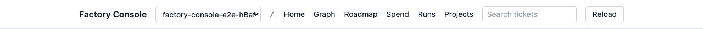
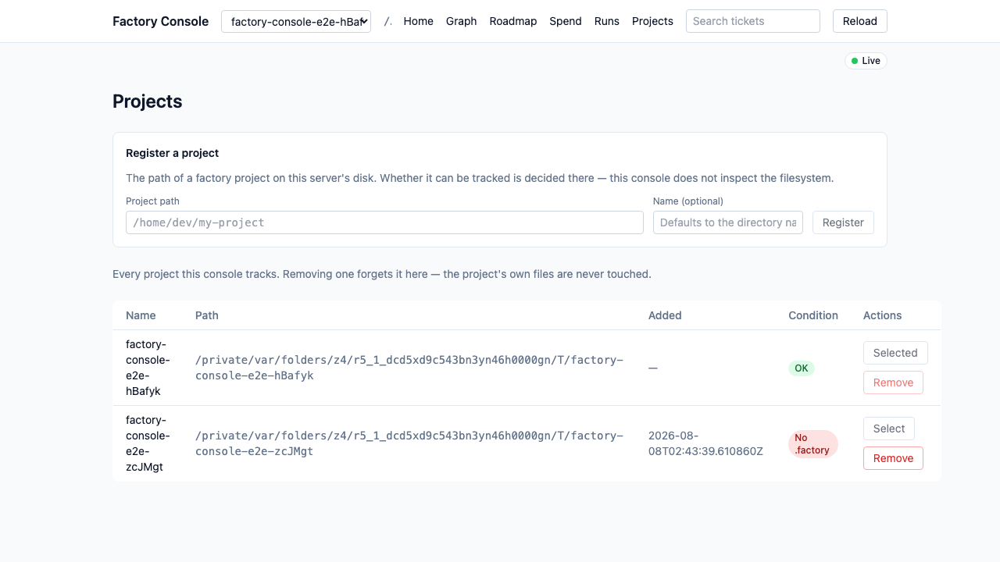

# Usage

## Install

Factory Console ships as a Python wheel on PyPI. Run it without installing, or
install it onto your PATH with pipx:

```
uvx factory-console            # run without installing
pipx install factory-console   # install onto your PATH
```

## Run

From any App Factory project directory:

```
cd my-factory-project && factory-console
```

The console discovers the project (walking up from the current directory for
`docs/planning/tickets.json`), starts a local server on `127.0.0.1`, and logs the
URL Uvicorn is serving. Your browser opens on that URL automatically unless you pass
`--no-browser`; press Ctrl-C to stop.

## Flags

```
factory-console [PATH] [--port N] [--host 127.0.0.1] [--no-browser] [--log-level LEVEL] [--version]
```

- `PATH` — the project directory to serve. A directory that holds no
  `docs/planning/tickets.json` is rejected with exit `1`.
- `--port N` — port to bind (`0` picks a free port). A port already in use is
  rejected with a clean exit `2`.
- `--host 127.0.0.1` — bind address; restricted to loopback (`127.0.0.1`,
  `localhost`, `::1`). A non-loopback host is rejected with exit `2`.
- `--no-browser` — don't open the browser on startup.
- `--log-level LEVEL` — logging verbosity (e.g. `info`, `debug`); logs go to
  stderr. An unrecognized level is rejected with exit `2`.
- `--version` — print the version and exit `0`.

**Path resolution:** an explicit `PATH` argument wins; without one the CLI walks up
from the current directory looking for `docs/planning/tickets.json`, the same way
`git` finds its repo root. For the authoritative contract see the CLI section of
[`planning/ARCHITECTURE.md`](planning/ARCHITECTURE.md).

## Environment

- `FACTORY_CONSOLE_HOST` / `FACTORY_CONSOLE_PORT` / `FACTORY_CONSOLE_LOG_LEVEL` — env
  equivalents of the flags above. An explicit flag wins over the env var, and the env
  var over the default; all three run through the same validation either way.
- `FACTORY_CONSOLE_WRITE_TOKEN` — a **development and testing** override that pins the
  write token below to a fixed value instead of minting a fresh one. Normal runs leave
  it unset; the token is per-session by design. If you do set it, it must be at least 16
  characters — a blank or too-short value is rejected with exit `2` rather than silently
  falling back to a generated token.
- `FACTORY_CONSOLE_DB_PATH` — where the console keeps its **own** store; see
  ["The console store"](#the-console-store) below. Unset (the normal case) means
  `~/.factory-console/console.db`.

### The write token

The console mints a write token at every start and prints it to **stderr**, so you'll
see a line like this in the output of any run:

```
X-Factory-Write-Token: 3s9Kv-1QpZ...
```

That token authorizes write requests, sent in the `X-Factory-Write-Token` header. It
lasts only as long as the process, so the one printed by a previous run stops working.
Reads never need it, so browsing the project is unaffected; the six write endpoints
require it on every request:

| Endpoint                          | Effect                                              |
| ---------------------------------- | ---------------------------------------------------- |
| `POST /api/v1/tickets`             | create a ticket (`201`, or `200` on a dry-run)       |
| `PUT /api/v1/tickets/{id}`         | edit a ticket (`200`)                                |
| `DELETE /api/v1/tickets/{id}`      | delete a ticket (`200`)                              |
| `POST /api/v1/projects`            | register a project directory (`201`)                |
| `DELETE /api/v1/projects/{id}`     | stop tracking a registered project (`204`)           |
| `PUT /api/v1/projects/current`     | switch which registered project the console serves (`200`) |

Each returns the same `WriteResult` body carrying the unified diff of what changed, and
each accepts `?dryRun=true` to get that diff back **without** writing anything. `dryRun`
is the only query parameter these endpoints take, and it is matched exactly: any other
key — including a miscasing like `?dryrun=true` — is refused with
`400 unknown_query_param` rather than quietly applying the write you meant to preview.
Sending `dryRun` **more than once** (`?dryRun=true&dryRun=false`) is refused the same way
with `400 repeated_query_param`, because only the last value would otherwise bind — so a
request that asks for a preview must never apply.

Editing and deleting are gated on the ticket's factory run-state, and the two gates are
**not the same**. A ticket is **editable** when its run-state is `todo`, or `unknown` —
which covers a project with no run-state source at all and one whose source resolved but
lists no ticket whatsoever. A ticket a lane owns (`in_progress`, `ready`, `merged`,
`flagged`, and the rest of the factory's vocabulary) is refused with
`409 ticket_not_mutable`. A ticket that a **populated** run-state source simply does not
list resolves `absent`: it is refused an **edit**, and the message names the source it
consulted — but it can still be **deleted**. A source that is there and could not be read
resolves `unreadable` and refuses **both**. ["Editing tickets"](#editing-tickets) below
has the full rule with the cases that motivate it. That gate guards the **write**, so it
fires on an apply; `?dryRun=true` still returns the preview diff for such a ticket, and
the refusal comes when you apply it. Creating an id that already exists, by contrast, is
refused with `409 write_conflict` on **both** paths, because previewing a create that
could never succeed would be a misleading preview. A missing or wrong token is
`401 write_token_invalid`, and an id outside the ticket-id pattern is
`400 invalid_ticket_id`.

#### Using the token from the UI

The console's own edit/delete affordances go through the same endpoints, so they need
the same token. The first write you attempt raises a **"Write token required"** prompt —
paste the value from that stderr line into it. It is held in `sessionStorage`, so it
survives a reload but is **per browser tab** and gone when the tab closes, matching the
token's own per-process lifetime. If the server is restarted the held token stops
working; the next write reports that it was rejected, discards it, and asks for the
current one. Pasting a fresh token resumes an in-progress **create or edit**
automatically; a pending **delete** is not resumed — the confirmation is asked again,
since auto-resuming a destructive action off the back of an unrelated token paste is not
something to do without the user looking at it.

The run-state gate above is mirrored in the UI: for a ticket the gate refuses, the Edit
and Delete buttons are disabled — separately, since delete is the wider of the two — and a
banner names the run-state that made it read-only. That mirror is convenience only — the
server enforces the gate regardless.

The console binds to loopback only, so the token is defence-in-depth _behind_ that
boundary — it stops another process on your machine, or a drive-by request from a page in
your browser, from mutating the project. There is no command-line flag
for it, because anything on the command line is readable by every local process.

If you pinned the token with the dev override above, the value is _not_ echoed — you
already have it, and printing it would copy it into whatever captures stderr — so the
line reads `X-Factory-Write-Token: <pinned, not echoed>`.

### The console store

Separately from the project it serves, the console has a small store of **its own**
state — a SQLite database at `~/.factory-console/console.db`. Nothing belonging to a
project is copied into it: tickets, run-state and roadmap are always read straight
from that project's files.

`FACTORY_CONSOLE_DB_PATH` overrides the location. It names the **file**, not a
directory, so two runs can keep two separate stores side by side in one temporary
directory — which is how the test suites stay out of your real one. Setting it to an
empty value is rejected rather than treated as "use the default", since an empty
override is almost always a variable someone meant to set and didn't.

Neither the file nor its directory is created up front. The store is created **lazily,
the first time something actually reads or writes it** — a registry endpoint call, not
just the CLI boot — and the directory is created `0700` and the database file `0600`,
because a later version keeps credentials in it. Starting `factory-console PATH` never
creates it by itself (`SqliteProjectRegistry()` construction is side-effect-free), so a
boot that never opens the browser UI and calls no registry endpoint at all — a CI job or
script driving the API directly — leaves no `~/.factory-console/` behind.

**Opening the browser UI now does create it.** The header's project dropdown (see
["Projects"](#projects) below) reads the registry on every page, so the
first `GET /api/v1/projects` that load fires — same as the first `POST` from a
headless caller — is what creates the store. A throwaway clone visited only through the
API, never through the browser, still leaves no trace; a Playwright run or any other
browser visit does not, which is why the e2e and integration suites both point
`FACTORY_CONSOLE_DB_PATH` at an isolated temp file rather than sharing this one.

Deleting it is safe and is the supported reset: stop the console and
`rm -rf ~/.factory-console` (or the directory your override points at). All you lose is
the list of registered projects — no ticket, run-state or roadmap data is in there — and
the next registry call recreates the store empty.

## Exit codes

| Code | Meaning                                                                                                                                                 |
| ---- | ------------------------------------------------------------------------------------------------------------------------------------------------------- |
| `0`  | ok (`--version`, or a clean run)                                                                                                                        |
| `1`  | project not found                                                                                                                                       |
| `2`  | invalid `--host` (non-loopback), out-of-range `--port`, unrecognized `--log-level`, a bad `FACTORY_CONSOLE_WRITE_TOKEN` pin, or the port already in use |
| `3`  | malformed ticket manifest                                                                                                                               |

## What you'll see

Every page shares a header with a **Factory Console** label, a **project switcher**
(present once the console tracks two or more projects), the served project path, a
navigation cluster (**Home / Graph / Roadmap / Spend / Runs / Projects** links plus a
**global search box**), and a **Reload** button. A **live-update indicator** pill sits just
below the header on the right.

### Projects

The console tracks a **registry** of projects and serves exactly one of them at a time.
The header's project dropdown appears once two or more are tracked, and switching it
changes which project the whole shell reads from — list, search, graph, roadmap, runs,
spend and the live-update stream all follow the selection. Below two projects the dropdown
renders nothing at all, so a console with a single project looks exactly as it did before
this existed. Behind it is the `/api/v1/projects` endpoint family: `POST` registers a
directory, `GET` lists the session row plus every registered one (each with its
`condition`), `PUT /current` switches which project every page reads from (live-update
stream included, registering never switches, and switching never unregisters), and
`DELETE /{id}` unregisters a row.

**`factory-console PATH` still works exactly as it did before v3.0** — same argument, same
exit codes, same startup line — and simply selects that project for the session. The
project you launch on is a **session** project: it is served for as long as the process
lives, it is the selection the session starts on regardless of what a previous session
switched to, and it is deliberately **not** written to the console store on its own. But
opening the browser UI over that clone is not trace-free either, because the dropdown's
own registry read creates the store the first time it runs (see
["The console store"](#the-console-store) above) — only driving the API directly,
without ever loading the browser UI, stays trace-free.

Where a switch lands depends on what the current URL names. A URL that names a **view** —
`/`, `/search`, `/graph`, `/roadmap`, `/spend`, `/runs`, `/tickets/new` — describes the new
project as well as it described the old one, so the page stays put and re-reads. A URL that
embeds a **ticket id** (`/tickets/<id>` and its `/deps`) goes home to `/` instead: an id is
a fact about one project's manifest, and carrying it across would deep-link into a ticket
the new project most likely does not have. Only a *switch* is redirected — a hand-typed
deep link into a missing ticket still renders the ordinary "not found" panel.

Multiple projects is **not** multiple users. Starting the console **without** a project
directory is not available yet: without a `PATH` (and with no App Factory project above the
current directory) the CLI still exits `1`, even when the store holds registered projects.
The pathless long-running mode, `factory-console serve`, arrives in a later version, and
remote access is out of scope for v3.0 too — the console still binds to loopback only, and
the write token is still per-session and shared by whoever can reach it.

#### Managing the registry

The dropdown's trailing **Manage projects…** entry, and the **Projects** link in the header
nav, both open `/projects` — a form to **register** a project by its path on the server's
disk (with an optional name, defaulting to the directory's own), above every row the
console tracks, with its probed `condition`, whether it is `Select`ed, and whether it can
be `Remove`d. The form validates only that the path box is not empty; the server decides
whether the path is well-formed (`invalid_project_path`), resolves to an App Factory
project (`project_not_found`), and is not already tracked (`duplicate_project_path`),
surfacing whichever refusal fires verbatim. All three writes
need the same write token as every other write in the console:
acting on a row (or registering one) before a token is held raises the same token prompt
as elsewhere, and a rejected token is dropped and re-asked for exactly as it is on the
ticket routes. `Remove` asks for confirmation and then only forgets the row in this
console's own registry — nothing on the project's own disk is touched, and it can be added
again later.
A row cannot be removed while it is the one selected, or while it is the reserved
session project (the one passed on the command line, which was never added to the
registry in the first place); either case disables the button and states why. A row
whose condition is not `ok` cannot be selected onto, for the same reason: the server would
accept the switch, but every other page would then be reading a project it cannot serve.
Such a row stays **listed** — in the table and in the dropdown, where it is labelled
`(unavailable)` and cannot be chosen — rather than quietly disappearing.

The conditions are named, and they do not mean the same thing. Most degraded first — which
is also the order they win in when more than one applies: `unreadable` (the path is there
and could not be read at all, a permissions or I/O problem, so nothing about its contents
is claimed), `path_missing` (nothing exists at the registered path any more — it was moved,
renamed or deleted), `not_a_project` (the path exists and is readable, and holds no
`docs/planning/tickets.json`, so it is not an App Factory project), and `no_factory_dir` (a
real, browsable project with no `.factory/` directory on **this machine** — its plan,
tickets and roadmap read normally, and only run-state, runs and spend are legitimately
unknown, which is the ordinary state of a fresh clone). A degraded row's condition also
surfaces as a banner under the top bar, on
whichever route the console is currently showing, naming what went wrong and its remedy —
or, for `no_factory_dir`, that nothing actually is wrong.

### Ticket list, detail, and deps

The landing page (`/`) is a searchable, filterable list of every ticket. Open a
ticket for its detail view — the rendered `.md` body, resolved
`depends_on` / `provides`, and a factory run-state badge — and follow "View dep
neighborhood" for that ticket's direct deps and dependents as clickable links.

### Editing tickets

Editability is decided by the ticket's factory run-state, read from the project's
**run-state source** — `.factory/run-state.json` if the factory wrote one, otherwise a
legacy marker directory (`.factory/run-state/`, then `docs/planning/.run-state/`).

**Editable:** a ticket whose run-state is `todo`, and a ticket whose run-state is
`unknown` — which covers a project with **no** run-state source at all *and* a project
whose source resolved but lists no ticket whatsoever. A project the factory has never
touched here is therefore fully editable, as it should be. A ticket a lane owns
(`in_progress`, `ready`, `in_part`, `in_submilestone`, `merged`, `flagged`, `failed`,
`needs_human`) stays read-only — the detail view disables Edit and Delete and names the
run-state that did it.

**Deletable but not editable (`absent`):** when the run-state source *is* populated and
simply does not list this ticket, an edit is refused (`409`, naming the file or directory
consulted) while a **delete is allowed**. Delete is deliberately the wider gate. Creating
a ticket is ungated, so a ticket the console just minted is `absent` in any project whose
run-state is populated — the concrete case being a ticket you add by hand, or mistype into
the **New ticket** form. Refusing the delete too would leave that ticket unrecoverable
through the very UI that created it. Such a ticket can be deleted but not edited until the
factory seeds it into the run-state.

**Neither editable nor deletable (`unreadable`):** if the run-state source is there and
could not be read — no permission on the file or directory, an entry that will not resolve,
or a state name outside the vocabulary this console knows — the console refuses **both**
writes and names the source in the message. This is not a lifecycle state a factory lane
put the ticket into; it is a broken source, and the fix is to the **source**: correct its
permissions (or upgrade the console, when the message names a state value it does not
know). Note the consequence: in a project with an unreadable run-state source, even a
ticket you have just created can be neither edited nor deleted until the source reads
again.

Every write also needs the write token; both gates are covered in ["The write
token"](#the-write-token) above.

- **Create** — the **New ticket** link on the ticket list (`/`) opens `/tickets/new`
  with a blank form (id, title, `depends_on`, `provides`, files, and the Markdown
  body).
- **Edit** — an eligible ticket's detail view opens the same form pre-filled with its
  current fields, except that the id is read-only: an edit never renames a ticket.
- **Delete** — an eligible ticket's detail view offers a delete action guarded by a
  confirmation step.

Create and edit both save through a **preview → confirm** flow: submitting the form
first sends a dry-run request and opens a diff-preview modal showing the exact unified
diff that would be written — nothing is written yet. Confirming from that modal sends
the same request again without `dryRun`, applying the write; canceling discards it and
returns to the form unchanged. The first write in a browser tab prompts for the write
token; if that token is later rejected because the server restarted, pasting the current
one resumes the parked create or edit on its own, with no second confirm — see
["Using the token from the UI"](#using-the-token-from-the-ui) above for the full rule,
including why a pending delete asks for its confirmation again instead.

### Global search

The search box in the header is a **full-text** search over a ticket's `id`,
title, `provides`, _and_ body Markdown. Type a term and press Enter to land on
`/search`, which lists the matching tickets (each row showing which fields
matched, e.g. `bodyMarkdown`); every result
links through to its ticket detail. An empty or no-match query renders a friendly
empty state rather than an error.

### Dependency graph

`/graph` (the header **Graph** link) draws the whole project as a
dependency DAG. Each node is a ticket colored by its factory run-state — the
factory's own states (`todo`, `in_progress`, `ready`, `in_part`, `in_submilestone`,
`merged`, `flagged`, `failed`, `needs_human`) plus the console's three answers for
when no state was read (`unknown`, `absent`, `unreadable`) — and edges point from a
ticket to the tickets it depends on. Click a node to open that ticket's detail page.

### Roadmap

`/roadmap` (the header **Roadmap** link) renders the project's `ROADMAP.md` as
milestone sections — each item shows its checkbox state and, when it references a
ticket, a monospace id link into the ticket detail — followed by the roadmap's
prose body.

### Runs

`/runs` (the header **Runs** link) is what the factory did, per ticket. One row per
ticket in `docs/planning/tickets.json`, in manifest order — including tickets the
factory has never run here, which are named as missing rather than left blank. Each
row shows the ticket id, its **run state** (from the run-state source), a **PR** link
when the lane recorded one, the lane's **outcome**, and whether a **receipt** was
written.

The two artefacts behind the PR / outcome / receipt columns are
`.factory/results/<id>.json` and `.factory/receipts/<id>.json`. When one is missing the
cell says **why**, and the reasons are not interchangeable: `—` (absent — the factory
never wrote it), **Unreadable** (there, but its contents and even its existence could
not be established), **Unparseable** (there, and not a JSON object — it answered,
unintelligibly), **Too large** (over the reader's size cap, so it was not read rather
than half-read).

**On a fresh clone you will see "No factory run data in this project."** `.factory/` is
machine-local and gitignored, so a clone carries no run artefacts. That is not the same
as the factory having run and recorded nothing — nothing has been recorded *on this
machine*, and these tickets' outcomes are unknown here rather than empty. The banner
names the two directories it probed so you can see where it looked.

Run state comes from a **different** source than those artefacts, so the two do not
imply each other: the legacy marker directory under `docs/planning/` is committed while
`.factory/` is not, so a fresh clone can show a full board of `merged` / `flagged`
badges beside a table of missing artefacts.

### Spend

`/spend` (the header **Spend** link) is what the factory cost, read from its ledger at
`.factory/metrics/ledger.jsonl`. It shows the **total** spend and token counts (input,
output, cache read, cache creation), then three breakdowns: **by ticket**, **by model**
(the model id verbatim, as the factory wrote it), and **by level** (agent level).

**Attributed cost — per-ticket figures can sum to more than the total, on purpose.** A
single lane often touches several ticket ids, and its cost is charged **in full to each
id it names** (the page states the rule as `full-to-each-id`). So the *By ticket*
column reports **attributed** cost, and adding it up can exceed the grand total. This is
a deliberate design choice, not a bug: splitting a lane's cost across the ids it touched
would invent a division the factory never recorded, so the console reports the whole
cost against each id the work was for.

Two more things the page will tell you rather than guess at:

- **No ledger** — on a fresh clone (`.factory/` is gitignored) you get "No spend ledger
  for this project", naming the path it looked at, and **no figures at all**. A table of
  zeros would be a claim about real money that nobody measured; this project's cost is
  *unknown* here, not zero.
- **Partial or unknown** — if the ledger exists but could not be opened, the page says
  spend is unknown and again shows no figure. If individual lines could not be read, the
  total is labelled **Partial total** right next to the number, with a count of the
  excluded lines.

### Live updates

The console watches the project on disk. When its tickets change — the run-state
source changes, or a ticket's `.md` is edited — an open page **auto-refreshes**
over a Server-Sent-Events stream — no manual reload needed. The indicator pill reflects the stream's health: **Connecting…** while it
opens, **Live** once connected, **Offline** if the stream drops, and it briefly
flashes **Updated** when a change arrives. Where the browser has no `EventSource`,
the app degrades gracefully to the manual **Reload** button.

### Screenshots

Captured from the real UI by the Playwright screenshots pipeline against the
`with_run_state` fixture — and, for the two multi-project shots, a second console
tracking both it and the `minimal` fixture — see the ["Screenshots"](../README.md#screenshots)
section of the root README to regenerate them. The editing flow (create/edit +
diff-preview) isn't captured yet; adding it means extending the same pipeline with a
`/tickets/new` (or edit) capture, not a new mechanism.


_The searchable ticket list at `/`._


_The `CAD-125` detail view with rendered body, deps, and run-state badge._


_The `CAD-125` dependency neighborhood listing its direct deps._


_Full-text search for `idempotent` at `/search`, matching two ticket bodies._


_The `/graph` dependency DAG, nodes colored by factory run-state._


_The `/roadmap` milestone view rendered from the project's `ROADMAP.md`._



_The header's project switcher, over a console tracking two projects._



_The `/projects` registry table, listing both tracked projects with their conditions._


_The live-update pill in its connected `Live` state._
